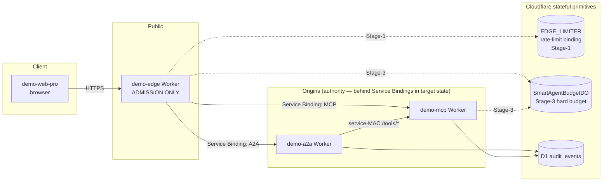
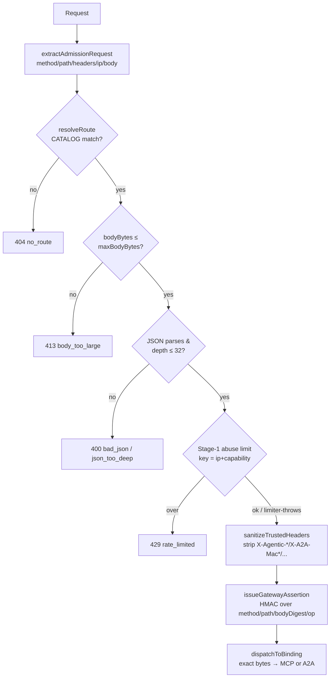
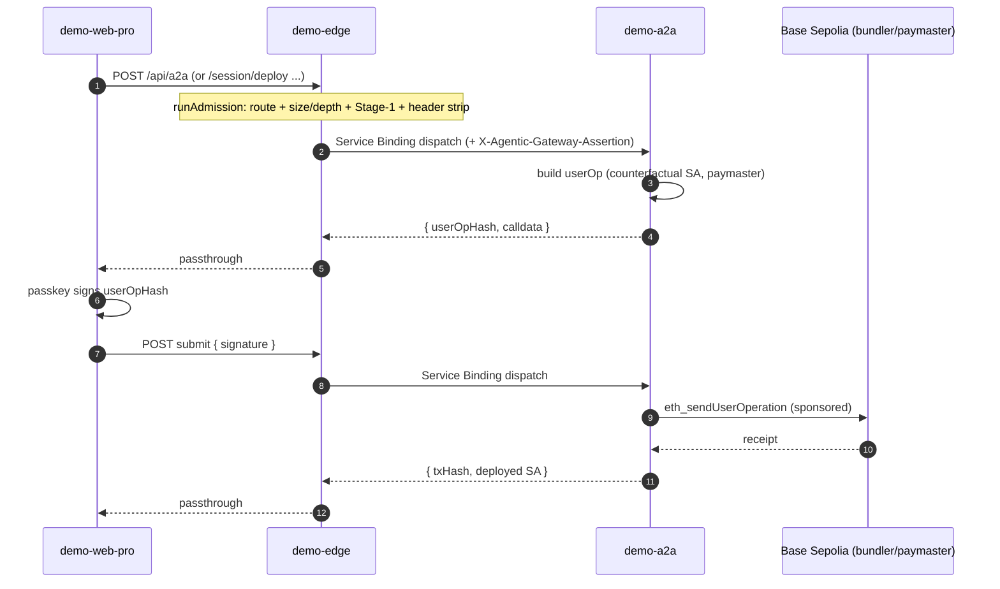
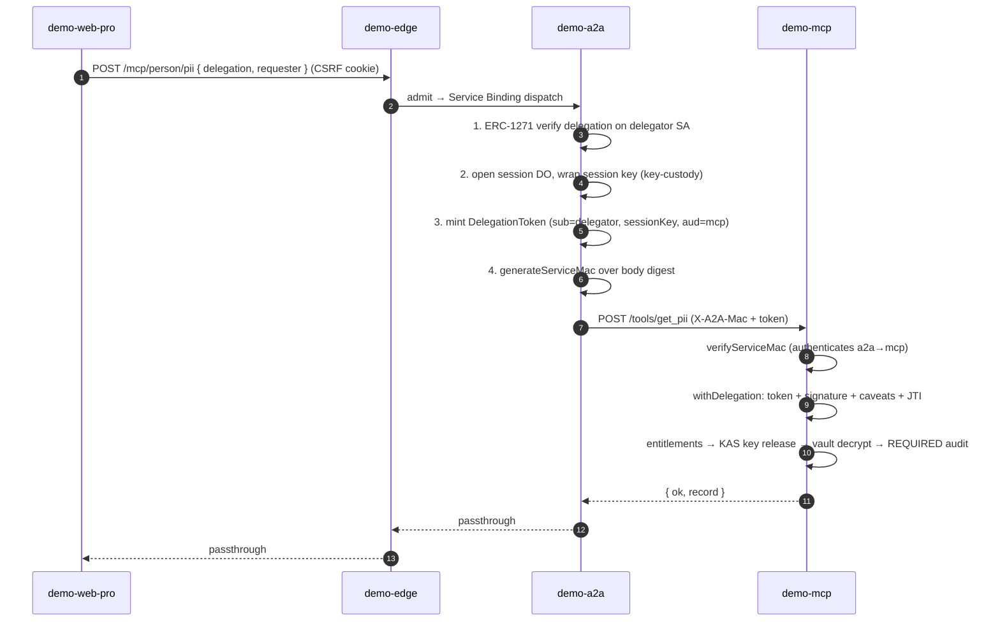
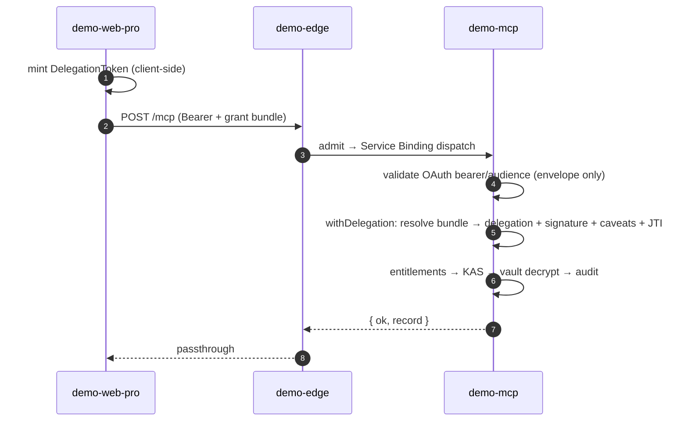

# demo-edge — architecture & message flow

How the **Agentic Edge** ([`apps/demo-edge`](../src/index.ts), [spec 288](../../../specs/288-agentic-edge-admission-and-capability-registry.md))
sits in front of the demo stack and what an end-to-end request looks like from a browser client
([`apps/demo-web-pro`](../../demo-web-pro/), the Treasury Service Agent demo) through **demo-edge → demo-a2a → demo-mcp**.

> **The one rule that explains everything below:** the edge owns **admission**, never **authority**
> ([ADR-0043](../../../docs/architecture/decisions/0043-edge-owns-admission-never-authority.md)). The edge
> decides *"may these exact bytes enter, for this route, right now?"* The downstream Workers decide
> *"did this Smart Agent authorize this exact call?"* — and that decision runs unchanged behind a Service
> Binding. Two trust boundaries, two proofs, never conflated.

---

## 1. Cast of services

| Service | Role | Owns | Deploy |
| --- | --- | --- | --- |
| **demo-web-pro** | Browser client (Vite/React, port 5273) | UX + calldata; mints delegation tokens + invocation proofs client-side. **Not** authority. | Cloudflare Pages |
| **demo-edge** | The public **admission** ingress | route resolution, header hygiene, size/depth/envelope, Stage-1 abuse limit, GatewayAssertion, Stage-3 budget DO host, discovery doc | Worker (`workers_dev=true`) |
| **demo-a2a** | Agent-to-agent Worker | session/custody, userOp build/submit, delegation minting, the relay→MCP hop (service-MAC) | Worker |
| **demo-mcp** | MCP resource server | the full Web3 **authority** pipeline: `withDelegation` (delegation + signature + caveats + JTI), entitlements, KAS key release, vault decrypt, audit | Worker |

**Authority lives only in demo-a2a / demo-mcp** (via the `delegation` / `mcp-runtime` / `tool-policy` /
`entitlements` / `key-authorization` packages). demo-edge is forbidden from importing any of them
(`check:edge-no-authority-imports`).

---

## 2. Topology



The `SmartAgentBudgetDO` is **cross-script bound**: both demo-edge and demo-mcp reach the *same* DO class so
there is exactly **one hard-budget authority per Smart Agent** ([spec 290](../../../specs/290-rate-control-and-usage-accounting.md) §8–§9),
never independent quotas per ingress.

---

## 3. demo-edge per-request pipeline

Every non-discovery request runs the vendor-neutral admission pipeline
([`edge-runtime/src/admission.ts`](../../../packages/edge-runtime/src/admission.ts)) via the Cloudflare
adapter ([`edge-cloudflare`](../../../packages/edge-cloudflare/)):



Key properties (all in [`apps/demo-edge/src/index.ts`](../src/index.ts)):

- **Route catalog is app config** (`CATALOG`), never in the generic packages ([ADR-0021](../../../docs/architecture/decisions/0021-generic-packages-vs-white-label-apps.md)):
  `POST /mcp/native` → MCP, `POST /mcp` → MCP, `POST /api/a2a` → A2A, `GET /.well-known/agent-card.json` → A2A.
- **Stage-1 abuse limit is fail-soft** — a throwing/over-limit limiter at this tier must never block authority
  work incorrectly; it keys only on `ip|capability`, **never** a claimed SA address (you cannot exhaust a
  victim's bucket pre-verification).
- **GatewayAssertion is admission proof only.** The edge HMAC-signs `{iss, aud, method, path, bodyDigest,
  operationId, correlationId, exp}` over the *exact* forwarded bytes; the origin recomputes the body digest
  and verifies it. It proves "the edge admitted these bytes," **never** SA authorization.
- **Single generic error on failure** — the internal classifier (`no_route`, `body_too_large`, …) is never
  echoed (info-leak); the client gets `{error:'admission denied', correlationId}` only.
- **Exact-byte forwarding** — the edge never re-serializes, because the native pipeline re-hashes the body
  for the spec-287 invocation proof (any re-encode would break the proof).

---

## 4. The four message flows

demo-mcp exposes **three ingress paths**, plus demo-a2a's own session/userOp surface. The edge fronts all of
them. Below, each flow is shown as it will run **through the edge** (target state — see §6 for what's live today).

### Flow A — Treasury setup / gasless userOp (web → edge → demo-a2a)

The Act ladder (deploy person SA, create org, create treasury, schedule custody, execute calls) goes to
demo-a2a's `/session/*`, `/account/*`, `/custody/*` routes. No MCP. demo-a2a builds + submits the ERC-4337
userOp; the browser only signs hashes with its passkey.



### Flow B — Delegation-gated relay read (web → edge → demo-a2a → demo-mcp via service-MAC)

The "read PII / Org-sensitive" buttons. The browser holds a signed Variant-A delegation (from Act 5) and
posts it to demo-a2a, which is the **local authority** for this path: it ERC-1271-verifies the delegation,
mints a `DelegationToken` signed by a fresh session key, **service-MAC-wraps** it, and calls demo-mcp's
internal `/tools/<name>`. demo-mcp runs `withDelegation` (the real authority gate).



The **service-MAC authenticates the a2a→mcp hop**; the **delegation token authorizes the action**. demo-a2a
holds no long-lived signing authority over the user's data — it mints a scoped token from a delegation the
principal SA already signed.

### Flow C — OAuth public MCP (web → edge → demo-mcp `/mcp`)

A "public MCP client" path: the browser mints a delegation token, gets a bearer from demo-mcp's
`/oauth/token` (authorization-server stand-in), and presents it to `POST /mcp` with a grant bundle. No relay,
no MAC. The bearer is **only the ingress envelope** ([ADR-0041](../../../docs/architecture/decisions/0041-web3-authority-not-oauth-on-a2a-to-mcp.md));
the delegation inside is the authority.



### Flow D — Native public MCP with invocation proof (web → edge → demo-mcp `/mcp/native`)

The headline edge path ([spec 287](../../../specs/287-agentic-invocation-proof.md)). The browser mints an
ephemeral in-memory **native session key** ([`native-session.ts`](../../demo-web-pro/src/lib/native-session.ts)),
builds an `AgenticInvocationProofV1` binding **the exact arguments** of this one call, and posts
`{token, invocationProof, tool, args}` to `/mcp/native`. This is where **all** the new edge machinery shows
up at once: GatewayAssertion verify + invocation proof + Stage-3 budget DO.

```mermaid
sequenceDiagram
  autonumber
  participant W as demo-web-pro
  participant E as demo-edge
  participant M as demo-mcp
  participant DO as SmartAgentBudgetDO

  W->>W: mint token + buildInvocationProof(sessionKey signs EIP-712<br/>over chainId/audience/op/argsHash/tokenHash/requestId/window)
  W->>E: POST /mcp/native { token, invocationProof, tool, args }
  Note over E: runAdmission (route mcp.native, high, 256KB)
  E->>E: issueGatewayAssertion (HMAC over sha256(body))
  E->>M: Service Binding dispatch (+ X-Agentic-Gateway-Assertion)
  M->>M: recompute sha256(body) → verifyGatewayAssertion (admission proof)
  Note over M: advisory by default; REQUIRED under DEMO_REQUIRE_GATEWAY_ASSERTION
  M->>M: withDelegation (requireInvocationProof:true)
  M->>M: step 3.5 verify proof: argsHash recompute, tokenHash,<br/>sig→sessionKey (UniversalSignatureValidator), requestId one-shot
  M->>M: cross-check proof.sessionKey==token.sessionKey, proof.principal==token.sub
  M->>M: caveats + revocation + entitlements + KAS
  M->>DO: reserve(sponsorAgent=principal, 1 unit, idempotencyKey=requestId)
  DO-->>M: allowed / budget_exhausted
  M->>M: run tool → decrypt → audit
  M->>DO: commit(actualUnits) on serve / release on denial
  M-->>E: { ok, record }
  E-->>W: passthrough
```

What makes flow D different from C: the **invocation proof** upgrades "this key *may* call the tool" to
"this key signed *this exact call*, once, now" — closing the replay-with-different-args hole that a bare
delegation token leaves on a public endpoint. The Stage-3 budget runs **after** authority succeeds, keyed by
the *verified* principal (never a claimed address), and is idempotent on the proof's one-shot `requestId`.

### Discovery — `GET /.well-known/agentic-authorization`

Served at the edge from **public on-chain config only** (chainId, entryPoint, delegationManager,
universalSignatureValidator) via [`agentic-authorization`](../../../packages/agentic-authorization/). No
binding hop, no secrets — it lets an Agentic-aware client self-configure without pretending to be an OAuth
server.

---

## 5. The new edge stack — package → role

| Package / surface | Role in the flows above |
| --- | --- |
| [`edge-runtime`](../../../packages/edge-runtime/) | vendor-neutral `EdgeAdapter`, `runAdmission` pipeline, `sanitizeTrustedHeaders`, `GatewayAssertion` issue/verify port |
| [`edge-cloudflare`](../../../packages/edge-cloudflare/) | CF adapter: `extractAdmissionRequest`, Workers rate-limiter binding (Stage-1), `dispatchToBinding` |
| [`capability-registry`](../../../packages/capability-registry/) | `CapabilityDescriptor` type (route + risk tier + limits + maxBodyBytes) the edge resolves to |
| [`rate-control`](../../../packages/rate-control/) | vendor-neutral `SoftRateLimiter` / `HardBudgetStore` interfaces + reserve/commit/release semantics |
| `rate-control-cloudflare` | `createCloudflareRateLimiter` (Stage-1) + `SmartAgentBudgetDO` (Stage-3 hard budget) |
| [`agentic-authorization`](../../../packages/agentic-authorization/) | the `/.well-known/agentic-authorization` discovery profile |
| `mcp-runtime` (origin only) | `withDelegation`, `verifyServiceMac`, `AgenticInvocationProofV1` verify, `enforceBudget` |

Three Cloudflare-specific primitives do the heavy lifting: **Service Bindings** (private worker→worker hop,
no public network), the **rate-limiter binding** (Stage-1 abuse), and **Durable Objects** (`SmartAgentBudgetDO`,
the single serialization point for one SA's hard budget, `reserve` inside `ctx.storage.transaction`).

---

## 6. Today vs target (be honest about what's live)

| Aspect | Today | Target |
| --- | --- | --- |
| Client → origin path | demo-web-pro talks **directly** to demo-a2a (vite `/a2a` proxy → `:8787`) and to demo-mcp (`VITE_DEMO_MCP_URL`) | all external traffic enters via **demo-edge** |
| Origin public exposure | demo-a2a/demo-mcp keep `workers_dev=true` (callers depend on it) | `workers_dev=false`, public routes dropped — **route lockdown** |
| GatewayAssertion | **advisory** (verified if present; not required) | **required** under `DEMO_REQUIRE_GATEWAY_ASSERTION` once all callers route via edge |
| Native MCP (`/mcp/native`) | flag-gated `DEMO_NATIVE_MCP_ENABLED`; proof + budget DO live | GA on the locked-down edge |

**Route lockdown is sequenced LAST and gated on a caller-migration checklist** (spec 288 §6): making the
origins private before every caller (`demo-sso /a2a` proxy, demo-web*, demo-mcp consumers) is repointed at the
edge is an outage. Until then the edge *fronts* the origins rather than being the *only* door. The
authority behavior at the origin is byte-for-byte identical whether reached directly or via the edge — that's
the whole point of ADR-0043.

---

## 7. Trusted-header hygiene (the Phase-0 spoof fix)

The edge strips these internal headers from any **unauthenticated** caller
([`edge-runtime/src/headers.ts`](../../../packages/edge-runtime/src/headers.ts)) so a direct public caller can
never inject them:

`x-agent-subdomain · x-public-origin · x-correlation-id · x-a2a-mac · x-a2a-mac-nonce ·
x-a2a-mac-timestamp · x-a2a-mac-key-id · x-agentic-principal · x-agentic-delegation ·
x-agentic-gateway-assertion`

They pass through untouched only when the request arrived through a verified boundary. This is why the
GatewayAssertion is the edge's *own* signed marker — it's the trustworthy "this came through admission"
signal the origin keys on, not a client-supplied header.

---

## References

- [ADR-0043 — the edge owns admission, never authority](../../../docs/architecture/decisions/0043-edge-owns-admission-never-authority.md)
- [ADR-0041 — Web3 is the authority; the envelope is not](../../../docs/architecture/decisions/0041-web3-authority-not-oauth-on-a2a-to-mcp.md)
- [spec 287 — Agentic Invocation Proof](../../../specs/287-agentic-invocation-proof.md)
- [spec 288 — Agentic Edge admission & capability registry](../../../specs/288-agentic-edge-admission-and-capability-registry.md)
- [spec 290 — rate-control & usage accounting](../../../specs/290-rate-control-and-usage-accounting.md)
- [Edge admission & authority hardening plan](../../../docs/architecture/edge-admission-and-authority-hardening-plan.md)
- Code: [`apps/demo-edge/src/index.ts`](../src/index.ts) · [`apps/demo-a2a/src/index.ts`](../../demo-a2a/src/index.ts) · [`apps/demo-mcp/src/index.ts`](../../demo-mcp/src/index.ts) · [`apps/demo-web-pro/src/treasury/acts/Act6OrgDashboard.tsx`](../../demo-web-pro/src/treasury/acts/Act6OrgDashboard.tsx)
