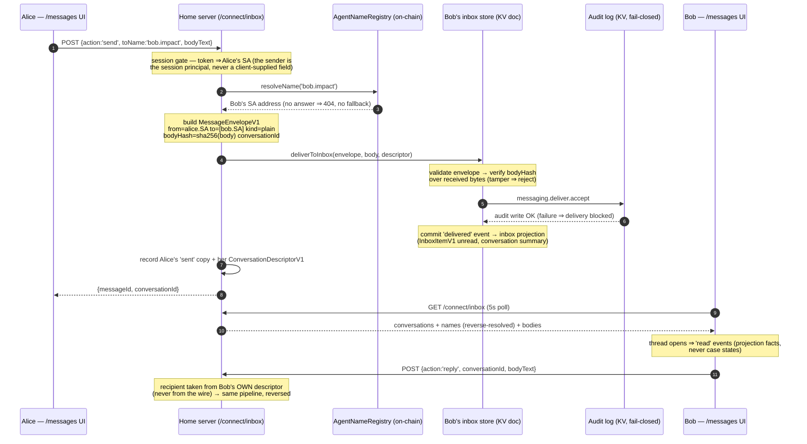

# Messaging + Interactions — demo guide

How this app wires the **fabric** ([spec 316](../../../../specs/316-agentic-interaction-fabric.md), which
absorbed [spec 309](../../../../specs/309-messaging-and-interactions.md)'s two packages) into a working
agentic inbox. Read this to adopt the same seam in your own app.

## The pieces

| Layer | Owner | Where in this app |
| --- | --- | --- |
| Envelope validation, body-hash binding, inbox reducer + rules, folder/conversation summaries | `@agenticprimitives/fabric/messaging` (pure subpath) | consumed by `src/home/inbox-data.ts` |
| Case state machine (11-state), audited transitions, action cards (transport half) | `@agenticprimitives/fabric/interactions` (pure subpath) | consumed by `src/home/inbox-data.ts` |
| Audited fail-closed admission (validate → body-hash → audit → commit) | `fabric/messaging.createAuditedInboxDelivery` | `deliverToInbox` in `src/home/inbox-data.ts` |
| Storage adapter (event-sourced KV doc per person, rehydrated per request) | **this app** | `src/home/inbox-data.ts` (deleted at spec 316 W6 in favor of the gateway vault) |
| Delivery endpoint (public transport half) | **this app** | `POST /connect/inbox/deliver` → `server/connect/inbox-deliver.ts` |
| Owner surface (session-gated read + send + reply + decisions) | **this app** | `GET/POST /connect/inbox` → `server/connect/inbox.ts` + the unified `app/(portal)/messages/page.tsx` (spec 313 v2) |

Terminology: a **message** is communication (never authority); an **interaction case** is a typed
decision workflow layered over messages (its approval *references* authority, minted by
`delegation`/`entitlements`); an **A2A/fabric task** is authorized execution. Spec 316 unifies all
three onto one `ExchangeRecordV1` (exec transport state + optional 11-state case substate); this app
currently exercises the messaging + case halves through the pure fabric subpaths.

## Interaction diagram — two agents chatting (T0 communication tempo, shipped today)

Alice sends Bob a message from her Home's Messages surface. Both Homes live on this app (demo
topology), so "delivery" is the same audited pipeline external senders hit via
`/connect/inbox/deliver`.



Key properties: the sender never writes into the recipient's store — admission is recipient-side and
audit-before-commit; the body hash is bound inside the envelope; empty resolution answers are answers
(ADR-0013); read/delivered are projection facts, not case states.

## Interaction diagram — request → approval → mandate (case lifecycle, T2 tempo)

An agent (or relying app acting for one) asks Bob for something. The ask travels as a message; the
decision is a case; the authority is a separately-minted delegation the case only references.

```mermaid
sequenceDiagram
    autonumber
    participant REQ as Requester agent / relying app
    participant DLV as POST /connect/inbox/deliver
    participant BOB as Bob's inbox store + case store
    participant AUD as Audit log
    participant BUI as Bob — /messages (Needs attention)
    participant SIG as Bob's ROOT credential (passkey/wallet/KMS)

    REQ->>DLV: {label:'bob', envelope(kind:request), bodyText,<br/>interactionCase(draft), card?}
    DLV->>DLV: reverseResolve(label) ⇔ addressee (one on-chain read)
    DLV->>BOB: audited admission (validate → bodyHash → audit → commit)
    Note over BOB: case bindings, all fail-closed:<br/>requester = envelope.from · responder = Bob<br/>rootMessageId = envelope.id · state = draft
    BOB->>AUD: interactions.transition.accept (submit)
    Note over BOB: case: draft → submitted<br/>card validated structurally — rendered with native<br/>components, no remote UI ever executes
    BUI->>BUI: request pinned in "Needs attention" + in-thread card
    BUI->>SIG: Approve + issue mandate — sign scoped delegation<br/>(Bob SA → requester, timestamp + value-0 caveats)<br/>+ InteractionMandateV1 referencing it by hash
    BUI->>BOB: POST {action:'transition', transition:'approve', mandate}
    Note over BOB: server gates, in order: structure → principal =<br/>session SA → ERC-1271 over re-derived digest →<br/>actingAgent = case requester
    BOB->>AUD: interactions.transition.accept (approve, AuthorityRef = delegation hash)
    Note over BOB: case → approved · mandate stored ·<br/>'credential-issued' control event on the timeline
    REQ->>REQ: later exercises the DELEGATION (revocable on-chain);<br/>the message thread was never the authority
```

## Delivery flow (inbound) — the admission pipeline in prose

1. Sender POSTs `{ label, envelope, bodyText, interactionCase?, card? }` to `/connect/inbox/deliver`.
2. The route binds label ⇔ addressee via one on-chain `reverseResolve` (ADR-0012/0013).
3. `createAuditedInboxDelivery` validates the envelope, enforces `bodyHash` over the UTF-8 body bytes,
   writes `messaging.deliver.accept|reject` to the KV audit log, and only then commits. An audit-write
   failure blocks admission (spec 291).
4. A `request` envelope carries a **draft** `InteractionCaseV1` (requester = sender, responder =
   recipient, root message = the envelope). The app drives the audited `submit` through
   `createAuditedInteractionStore`; the case stays `submitted` until the responder's first move
   (`triage`) — delivery/read are message-event facts, not case states (spec 316 §2, 13→11).
5. An optional sender-proposed `ActionCardV1` (transport half) is structurally validated and stored; the
   Home renders it with native components — no remote UI code ever executes.

## Decision flow (owner)

The Messages page's Approve / Deny / Ask-info actions POST `{ action: 'transition', interactionId,
transition }` with the home session. The session gate binds the caller to the person SA; the **state
machine** enforces the role (a session cannot approve a case it is not the responder of). Decisions are
lifecycle facts — **a message is never authority**; issuance routes through `delegation`/`entitlements`/VC
packages and comes back as an `AuthorityRef` on the case.

## The org assistant in discussion topics (spec 327)

An org steward can enable the **organization's own agent** on a discussion topic (the 🤖 toggle in
the topic header). This is 318 §8.1's "the org being agentic" — the author is the **Org SA itself**
(ADR-0010), never a bot account or a Service participant; third-party bots stay a separate,
fabric-wave concern (318 C4).

Flow: a member posts `@<orgname> …` → `InteractionsDO.channels.post` evaluates the trigger
**post-commit, server-side** (the UI never detects or orchestrates — ADR-0044), rate-limits
(6/topic/10min), and fire-and-forgets an in-Worker, marker-gated call to the org's own `A2aTaskDO`
(`/internal/discussion-respond` — not on the public agent card). The turn runs the shared Ring-0
loop (`discussion-skill.ts`): Anthropic planner when configured, else a deterministic template
reply. The reply lands via `internal.channels.post` with `from`/`actor` **pinned to the org SA**
and `authorName` = the org's primary name (captured at enable time via one `reverseResolveString`),
riding the org's existing interactions grant — **no new grants, scopes, or secrets**. The UI badges
`actor`-marked entries "agent". Every dispatch/drop/reply is audited
(`interactions.assistant.*` / `interactions.channels.assistantPost`); failures are dropped, never
retried into another mechanism (ADR-0013), and never touch the member's own post.

## Where this is going (spec 316 target)

Today's demo topology (both parties on one Home, KV doc per person, 5s poll) is the app-layer stand-in
for the fabric's peer-to-peer target: each principal gets an addressable-on-demand gateway
(vault + MCP co-resident), discovery is one on-chain `gatewayRoot` point-read, delivery is a signed
`DeliveryEnvelopeV1` peer-to-peer with store-and-forward + signed `DeliveryReceiptV1`, and the Home
becomes a render client tailing the gateway's delta stream (optimistic echo → receipt-driven
pending→delivered→seen). The invariants in this guide — audit-before-commit, body-hash binding,
recipient-side admission, message-is-never-authority — survive unchanged.

## Invariants to keep if you copy this

- Never persist before the audited admitter resolves (audit-before-commit).
- Never accept a case whose requester ≠ envelope sender or responder ≠ recipient.
- Rehydration replays the SAME events through the SAME reducers — a replay divergence is a hard error,
  not a repair opportunity (ADR-0013).
- Bodies are plaintext in this demo's KV; production apps put them in the vault
  (`fabric/messaging.createVaultMessageBodyStore`) and store only refs.
