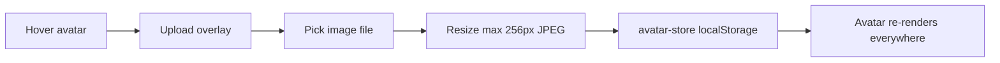

# Messaging UX Redesign — Telegram / Discord / Slack / Outlook Patterns

> **Scope:** `demo-sso-next` Messages + Org Channels surfaces  
> **Status:** P0 implementation in progress (2026-07)  
> **References:** Telegram (DM + in-group profile flow), Discord (group avatars, topic channels)

---

## A. Capability matrix

| Capability | Telegram | Discord | Current (pre-redesign) | Proposed |
|------------|----------|---------|------------------------|----------|
| Conversation list rail | Avatar + name + preview + unread badge | Server/channel sidebar | Basic rail, indigo inline styles | Amber token rail, avatar + preview snippet |
| Message bubbles | Grouped, tail on last, mine vs theirs | Similar + embeds | Grouped bubbles, indigo gradient | Shared `MessageBubble`, amber mine gradient |
| Avatar fallback | First letter, deterministic color | Same + default icon | `Avatar` component exists | Wired everywhere via `avatar-store` |
| Avatar upload | Profile photo | User + server icon | `imageUrl` prop unused | Local demo store + upload UI (P0); vault profile field (P1) |
| Group/channel icon | N/A (groups have photo) | Server + channel icons | None | Channel/community avatar upload (Discord-style) |
| Emoji in composer | Full picker + recent | Full picker | 56-char grid | Same grid, styled picker; categories (P1) |
| Image in messages | Inline photos, albums | Attachments + embeds | Text only | `` in body + renderer |
| Image attach in composer | Camera + gallery | Drag/drop + paste | None | Paperclip → resize → embed in body |
| Channel → DM | Tap member → profile sheet → Message; DM opens in-app | Right-click → Message | Profile popover → `/messages?to=` (workspace jump) | **DM slide-over** stays in channel context |
| Multiline compose | Textarea, Enter sends | Shift+Enter newline | Single-line input | Textarea; Enter send, Shift+Enter newline |
| Mobile layout | Single pane + back | Drawer nav | Fixed 2–3 col desktop only | `@media` collapse to list OR thread |
| Read receipts / typing | Optional | Optional | Poll 5s only | Poll retained; optimistic send (P1) |
| Rich requests in thread | N/A | N/A | Interaction cases inline | Preserved — amber attention band |

---

## B. Information architecture

### Navigation (unchanged routes, improved surfaces)

```
Person workspace
  /messages              → DM inbox (Telegram "Chats")
Org member workspace
  /org/:org/channels     → Topic channels (Discord server channels)
  /org/:org/messages     → Org steward inbox (admin)
Service workspace
  /service/:agent/messages → Service agent inbox
```

**Key IA change:** Channel member → DM no longer navigates away. A **slide-over panel** (Telegram mobile pattern) opens over the channel feed; the org context remains visible behind a scrim.

### Workspace model

- **Person ↔ Person DMs** always use the person's inbox (`/connect/inbox`, owner = person SA).
- **Channel posts** use org vault bodies (`/connect/channels`).
- The slide-over DM panel calls the **person inbox API** while visually staying on `/org/:org/channels`.

---

## C. Component breakdown

Extract from monoliths into `src/components/portal/chat/`:

| Component | Responsibility |
|-----------|----------------|
| `Avatar` | Letter fallback or image; sizes 28–72 |
| `AvatarUpload` | Click/hover upload overlay for person or group |
| `MessageComposer` | Textarea + emoji + attach + send; disabled states |
| `MessageContent` | Parse text + `` → render |
| `MessageBubble` | Grouped bubble with tail, timestamp, mine/theirs |
| `ConversationListItem` | Rail row: avatar, title, preview, unread |
| `ProfileSheet` | Full-height or centered sheet (replaces tiny popover on mobile) |
| `DmSlideOver` | Right panel: header, thread, composer; inbox-backed |
| `EmojiButton` | Popover grid (existing, restyled) |

CSS: `chat.css` — all chat surfaces use design tokens from `globals.css` (amber, not indigo).

---

## D. Interaction flows

### Channel → DM (Telegram pattern)

```mermaid
sequenceDiagram
  participant U as User
  participant CH as OrgChannelsView
  participant PS as ProfileSheet
  participant DM as DmSlideOver
  participant API as /connect/inbox

  U->>CH: Tap member avatar/name
  CH->>PS: Open profile sheet
  U->>PS: Tap "Message"
  PS->>DM: Open slide-over (recipient label)
  DM->>API: GET inbox (person scope)
  DM->>API: POST send/reply
  Note over CH,DM: Channel feed stays mounted; no AgentSwitcher jump
```

### Avatar upload



P1: persist `avatarDataUrl` in `ImpactStoredProfile` vault record.

### Image message

1. User attaches image in composer → client resizes (max 800px, JPEG 0.85).
2. Body stored as: `Optional caption\n`.
3. `MessageContent` renders caption + `` with max-width bubble constraint.

---

## E. Visual tokens (chat surfaces)

Uses existing portal tokens; chat-specific additions in `chat.css`:

```css
--chat-mine-bg: linear-gradient(135deg, #fbbf24, #d97706);
--chat-theirs-bg: var(--color-surface-sunken);
--chat-rail-active: var(--color-amber-50);
--chat-rail-unread: var(--color-amber-600);
--chat-composer-bg: #fff;
--chat-composer-border: var(--color-border);
--chat-slide-width: min(420px, 100vw);
```

Bubble radius 16px; tail corner 4px on last-in-group (Telegram).

---

## F. API / data model extensions

| Item | P0 (demo) | P1 (production) |
|------|-----------|-----------------|
| Person avatar | `localStorage` key `chat-avatar:{address}` | `ImpactStoredProfile.avatarDataUrl` in vault |
| Group avatar | `localStorage` key `chat-avatar:community:{org}` | Channel descriptor metadata or org profile |
| Image bodies | Markdown data-URL in `bodyText` | R2/CDN URL + vault body reference |
| Attachment size | Client cap 400KB after resize | Server-side limit + virus scan |

No inbox/channels API changes required for P0.

---

## G. Phased roadmap

### P0 (this slice)
- [x] Design spec (this doc)
- [x] `chat.css` + shared components
- [x] Amber-styled Messages + Channels
- [x] Avatar upload (local) + letter fallback wired
- [x] Group avatar on channel header
- [x] Image attach + inline render
- [x] DM slide-over from channels
- [x] Profile sheet (Telegram-style)

### P1
- Vault-backed avatars in profile store
- Optimistic send + scroll anchoring
- Emoji categories + recent
- Mobile single-pane navigation
- Paste image from clipboard

### P2
- WebSocket push (replace 5s poll)
- Read receipts
- Message reactions
- Thread replies in channels (Discord threads)

---

## H. Wireframe descriptions

### Conversation list (Messages)
Left rail ~280px: search field sticky top; rows 56px min-height; avatar 48px; title bold when unread; preview line truncated; amber unread pill. Active row: amber-50 background + left amber bar.

### Thread view (Messages)
Header: avatar + name + context chips. Body: flex column, bubbles max 72% width. Composer: fixed bottom, pill with attach + emoji + send circle (amber).

### Channel feed
Center column: channel header with `# topic` + member count + **editable group avatar** (Discord). Messages: avatar column for others (30px), grouped bubbles. Composer matches DM.

### Profile sheet (from channel)
Bottom sheet on mobile / centered card on desktop: large avatar (upload on own profile), name, handle, org subtitle. Primary button "Message" (amber). Secondary "Close".

### DM slide-over
420px right panel, full height: header with back chevron + recipient avatar/name; thread scroll; composer at bottom. Scrim dims channel behind; Escape closes.
