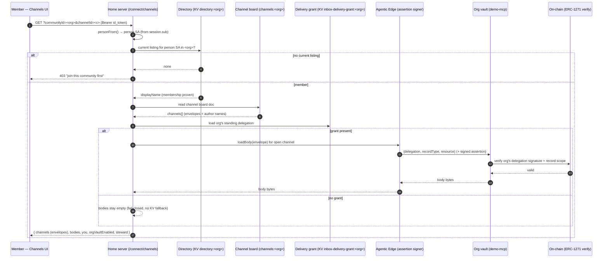
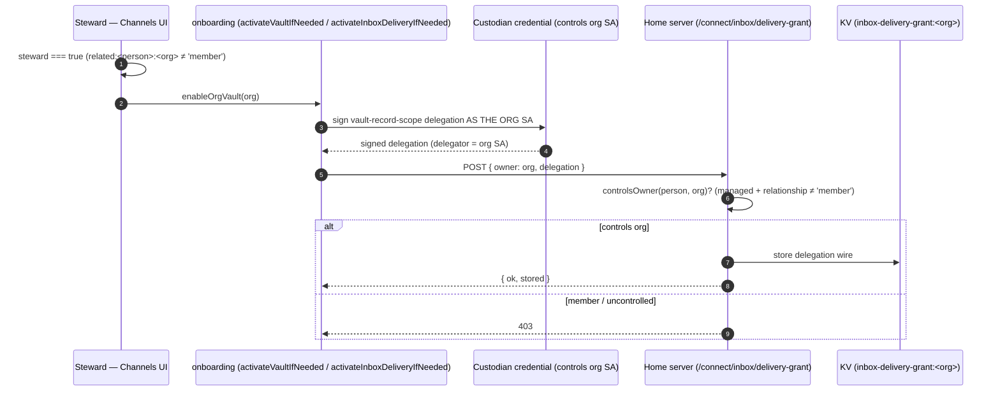
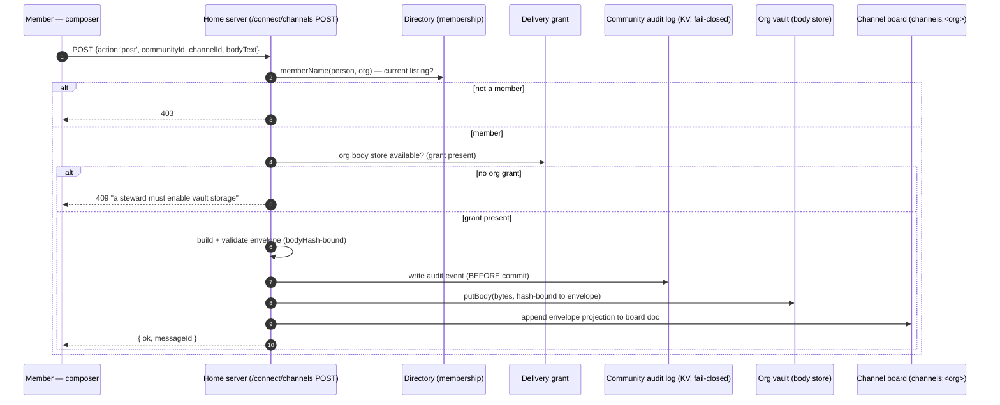

# Vault Architecture — how the Home reaches channel data

How this app (`demo-sso-next`, the Personal Trust Home) reaches **channel message data**, and the
authority that gates every step. The rule that shapes everything below: **message *bodies* live in a
vault, never in KV**, and the only key that opens a vault is an **on-chain-verified delegation signed by
the agent that owns it** — re-checked at the vault on every read, never trusted from the session alone.

Specs of record: [316 (interaction fabric)](../../../specs/316-agentic-interaction-fabric.md) ·
[317 (vault cutover)](../../../specs/317-messaging-fabric-substrate-migration.md) ·
[318 (org channels)](../../../specs/318-organization-channel-messaging.md) ·
[321 (org membership delegations)](../../../specs/321-org-membership-delegations.md). Governing decisions:
[ADR-0010 (SA is the identity)](../../../docs/architecture/decisions/0010-smart-agent-canonical-identifier.md) ·
[ADR-0013 (no silent fallbacks)](../../../docs/architecture/decisions/0013-no-silent-fallbacks.md) ·
[ADR-0041 (Web3 is the authority)](../../../docs/architecture/decisions/0041-web3-authority-not-oauth-on-a2a-to-mcp.md).

---

## Simplified description — the flow, in plain terms

Think of an organization's channels as a **shared bulletin board** with two separate stores:

- A **public-ish list of notes** (who posted, when, in which channel) — the *envelopes*. Cheap, kept in KV.
- The **actual text of each note** — the *bodies*. Sealed in the **organization's vault**.

To read the board you have to prove two different things, one per store:

1. **"I belong here."** Your **custodian credential** (passkey / wallet / Google) opened a Home session.
   That session says *who you are* — your **Smart Agent (SA) address**. To see the board, that SA must
   have a **current, self-signed membership listing** in the organization. No listing → `403`, full stop.
   This gets you the *envelopes* (the list of notes).

2. **"I'm allowed to open the sealed text."** The bodies are in the org's vault. Nobody — not even the
   Home server — can open that vault without a **delegation the organization itself signed**, authorizing
   a delivery service to read/write its vault. A **steward** (someone who *controls the org SA*) signs
   that delegation once. After that, reading a body means the server presents that delegation to the vault,
   and the vault **re-verifies the signature on-chain** before returning a single byte.

So there are **two kinds of custodian** in the story:

| Role | What their credential proves | What they can reach |
| --- | --- | --- |
| **Member** | *I am this person SA* + I hold a current listing | Read envelopes + bodies, post messages |
| **Steward** | *I control this org SA* | Everything a member can, **plus** sign the org-vault delegation that makes body storage/reads possible for the whole org |

The one-sentence version: **your credential proves identity → your listing proves membership (opens the
envelopes) → the org's steward-signed, on-chain-verified delegation opens the vault (reveals the bodies)** —
and if the delegation is missing, bodies simply don't appear (there is no cheaper backup path).

---

## The pieces

| Layer | Owner | Where in this app |
| --- | --- | --- |
| Session verification (Bearer `id_token` → person SA) | `@agenticprimitives/connect` | `personFrom()` in `server/connect/channels.ts` |
| Membership gate (current directory listing) | `@agenticprimitives/home` (`isListingCurrent`) | `memberName()` in `server/connect/channels.ts` |
| Channel board doc (envelopes + author names) | this app, vault-resident (spec 316 §11a) | `makeChannelsKv()` → `channels:<orgSA>` |
| Message-body store (bodies in the org vault) | `@agenticprimitives/fabric/messaging` | `makeBodyStoreFactory()` in `server/connect/message-body-store.ts` |
| Standing org-vault delegation (the key) | this app persists it; vault re-verifies it | `inbox-delivery-grant.ts` (`loadInboxDeliveryGrant`, `controlsOwner`) |
| On-chain signature + record-scope check at redemption | `demo-mcp` / `@agenticprimitives/delegation` | external — the vault, not this app |

---

## Interaction diagram — a member READS channel data

The common path: a member opens an org's Channels tab. Envelopes come from KV; bodies for the *one*
open channel are resolved from the org's vault over the org's standing delegation.

---

## Interaction diagram — a steward ENABLES the org vault (mints the key)

Before anyone can store or read bodies, a steward authorizes the org's vault **once**, signing *as the
org SA*. A member cannot do this — the ceremony signs with the org's authority.

---

## Interaction diagram — a member POSTS a message (body → vault)

Posting is membership-gated, audited before commit, and the body lands in the org's vault. The KV doc
keeps only the envelope projection.

---

## The authority model (why each gate exists)

1. **Identity is the SA, credential is a facet** (ADR-0010). Passkey/wallet/Google only *authenticate a
   session*; the session's `sub` is the canonical person SA. Every gate reasons about SAs, not credentials.

2. **Membership = a self-signed listing** (spec 312/318). Being discoverable and entering channels are the
   *same* opt-in consent — one signature the member controls and can revoke. Reading envelopes needs it;
   posting needs it. Fail-closed at `403`.

3. **Body residency is the vault, exclusively** (spec 317 cutover). The KV board doc holds only envelopes +
   author names. There is **no `doc.bodies` fallback** — if the vault path can't answer, bodies are empty
   (ADR-0013: one mechanism, empty is an answer, never escalate to a cheaper one).

4. **The vault opens only for an on-chain-verified delegation** (ADR-0041). The Home server presents the
   org's stored delegation; **demo-mcp re-verifies the signature (ERC-1271) and record scope at the vault**.
   The Home deciding "who may *store* whose grant" (`controlsOwner`) is a convenience gate — it is *not* the
   authority. The authority is the signature, checked at redemption.

5. **Steward vs member is a real capability boundary** (spec 321). `relationship:'member'` is authority-only:
   a member reads/posts but **cannot** provision the org's vault grant. Only a controller of the org SA
   (`related:<person>:<org>` ≠ `member`) can sign the enable ceremony.

6. **Grant scope is checked, not assumed** (spec 316 §11a). `grantCoversCurrentScope` requires the delegation
   to cover **both** `vault:inbox.data` and `vault:channels.data`. A pre-cutover / half-widened grant reports
   `orgVaultEnabled=false`, prompting the steward to re-sign — rather than silently failing writes with
   `record_scope_denied`.

---

## Key source references

| Concern | File |
| --- | --- |
| Session → person SA, membership gate, read/post handlers | `server/connect/channels.ts` |
| Gated body-store factory (fail-closed, no KV fallback) | `server/connect/message-body-store.ts` |
| Standing delegation store + `controlsOwner` + scope check | `server/connect/inbox-delivery-grant.ts` |
| Client read/post/join + steward enable | `src/components/portal/OrgChannelsView.tsx` |
| Signer routing by actual credential | `src/home/onboarding.ts` (`signHashFor`, `resolveVia`) |

> **Trust boundary reminder:** nothing in this app is the final authority over vault contents. This app
> authenticates sessions, gates *who may store whose delegation*, and shuttles bytes. The delegation's
> on-chain signature — verified at the vault — is what actually authorizes access. When the standard and the
> substrate disagree, the substrate wins (ADR-0041).
