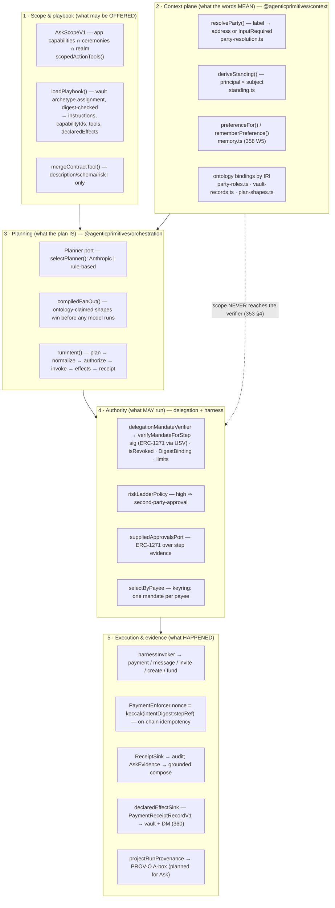
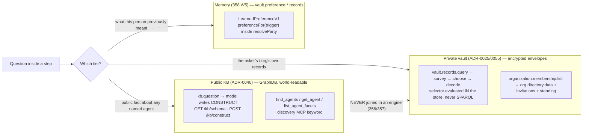
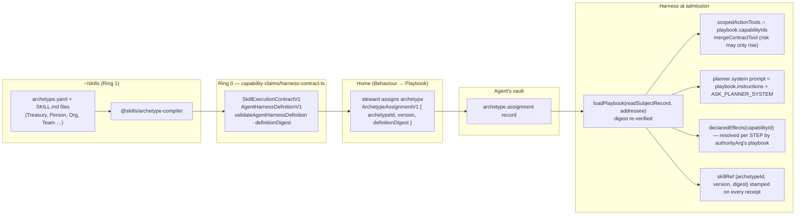
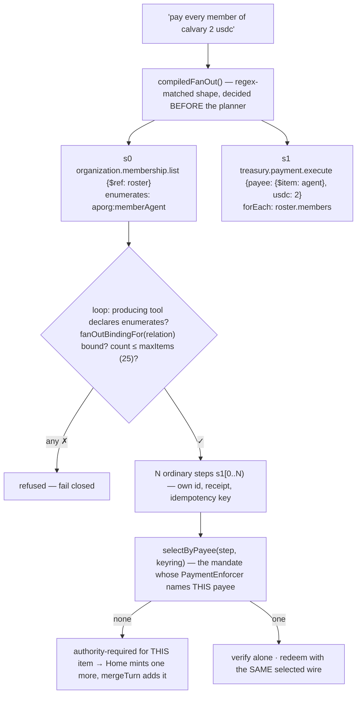
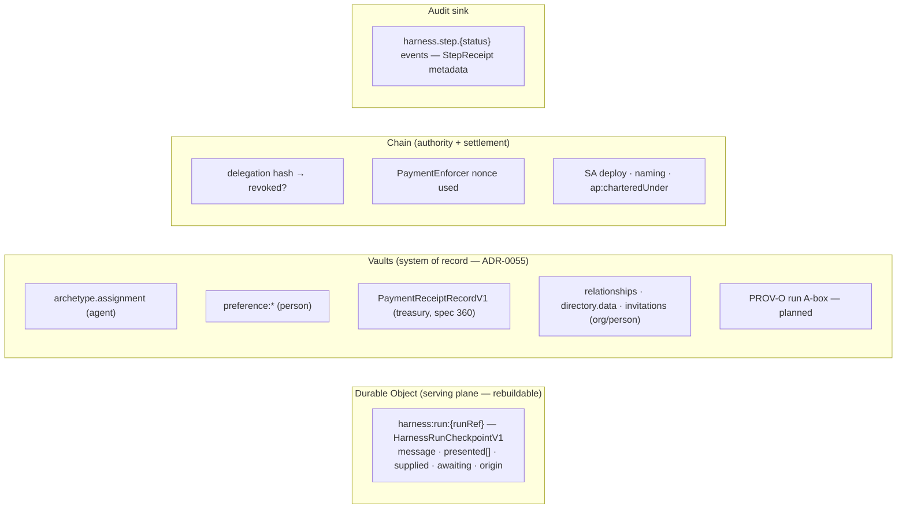

# The A2A agent harness — architecture diagrams, industry comparison, next steps

**Status:** describes the harness as it runs on 2026-09-06 (`apps/demo-a2a` `POST /harness/ask`). Every box names the
file or symbol behind it; where a box is designed but not live it is marked **planned**.
**Reads:** [spec 350](../../specs/350-authority-aware-agent-harness.md) (harness) · [352](../../specs/352-ask-capability-program.md) (Ask) · [353](../../specs/353-app-scoped-ask.md) (scope) · [354](../../specs/354-archetype-driven-agent-behavior.md) (playbooks) · [355](../../specs/355-ontology-driven-ask-and-orchestration.md) (ontology drives behavior) · [356](../../specs/356-ontology-grounded-vault-questions.md)/[357](../../specs/357-natural-language-questions-of-the-public-kb.md) (two knowledge tiers) · [358](../../specs/358-semantic-context-plane.md) (context plane) · [359](../../specs/359-focus-program-playbooks-domains-durability.md) (focus program) · [360](../../specs/360-declared-effects-what-follows-the-act.md) (declared effects).
**Companions:** [ask-inside-an-agent.md](ask-inside-an-agent.md) (plain-language walkthrough) · [harness-feature-priorities.md](harness-feature-priorities.md) (prioritized program) · [agentic-framework-competitive-analysis.md](agentic-framework-competitive-analysis.md) · [product-comparison/](product-comparison/README.md).

---

## Reading map — the harness document set (start here)

This is the canonical index for **how the `demo-a2a` harness works**, organised by the four questions
people actually ask. Every other harness doc and spec links back here. Read top-to-bottom for a first
pass; jump by question after that.

**A · The whole picture (read first)**

| Doc | What it gives you |
| --- | --- |
| **This doc** (`harness-architecture-diagrams.md`) | Five planes (§1), one full Ask turn (§2), the per-step authority state machine (§5), where state lives (§7), component-by-component vs LangGraph/MAF/Dapr/OpenAI (§8), ordered next steps (§12) |
| [`ask-inside-an-agent.md`](ask-inside-an-agent.md) | Plain-language walkthrough of two sentences (`send a message to alice`, `send 10 usdc to alice`) end to end; the honest "why it stumbles" inventory (§5) |
| [`agent-action-program.md`](agent-action-program.md) | The "how an agent is allowed to act" picture; orchestration (within one agent) vs coordination (between agents) |
| [spec 350](../../specs/350-authority-aware-agent-harness.md) | Normative harness: Ask → Intent → Mandate → Plan → per-step Verify → Receipt |
| [`apps/demo-a2a/CLAUDE.md`](../../apps/demo-a2a/CLAUDE.md) + [`README.md`](../../apps/demo-a2a/README.md) | What the Worker owns; the routes; what it does NOT own |

**B · What happens when an intent comes in** (intent → plan → verify → execute → receipt)

- Diagrams: **§2** (one Ask turn sequence), **§5** (authority per step), **§6** (fan-out + keyring).
- Story: [`ask-inside-an-agent.md`](ask-inside-an-agent.md) §4.
- Specs: [352](../../specs/352-ask-capability-program.md) (the Ask), [353](../../specs/353-app-scoped-ask.md) (scope narrows offers, never authority), [355](../../specs/355-ontology-driven-ask-and-orchestration.md) (ontology owns plan shape + party resolution).
- Code: `apps/demo-a2a/src/index.ts` (`POST /harness/ask`) → `src/harness-run.ts` (`runUnderMandate`, `scopedActionTools`, `mergeContractTool`) → `packages/orchestration/src/loop.ts` (`runIntent`) → `packages/delegation/src/mandate.ts` (`verifyMandateForStep`).

**C · Persistent / long-lasting flows** (durability, resume, approvals, multi-agent)

- Diagrams: **§7** (where state lives — the checkpoint is a rebuild, receipts/assignments/preferences are bereavements), **§12** #2–#3 (per-step checkpoint + durable approvals).
- Specs: [350](../../specs/350-authority-aware-agent-harness.md) W3 (durable runs — keyring + findable shipped; per-step checkpoint + alarms open), **[362](../../specs/362-durable-executor-port-and-cloudflare-workflows.md)** (the Ring-0 `DurableStepPort` + the first Cloudflare Workflows binding: *Cloudflare remembers where work stopped; the substrate decides if the next act is still authorized*).
- Multi-agent / long-lived work: [`coordination-vs-orchestration.md`](coordination-vs-orchestration.md), [ADR-0054](decisions/0054-coordination-endeavor-doctrine.md), specs [332](../../specs/332-coordination-endeavor-core.md)–[334](../../specs/334-coordination-work-surface.md); worked example [`scenarios/charter-team-and-enroll-workspace.md`](scenarios/charter-team-and-enroll-workspace.md).
- Code: `apps/demo-a2a/src/harness-runs.ts` (`HarnessRunCheckpointV1` + the checkpoint law: inputs, never conclusions), `src/a2a-task-do.ts` (`A2aTaskDO`, spec 269 — the canonical run record), `src/harness-workflow.ts` + `src/harness-workflow-core.ts` (the Workflows adapter — refs only), `src/endeavor-authority-steps.ts`.

**D · Knowledge & memory strategy** (three stores, never joined)

- Diagrams: **§3** (public KB = generated SPARQL over world-readable RDF; private vault = compiled selectors over encrypted envelopes; memory = the smallest tier).
- Specs: [356](../../specs/356-ontology-grounded-vault-questions.md) (vault questions), [357](../../specs/357-natural-language-questions-of-the-public-kb.md) (public KB questions), [358](../../specs/358-semantic-context-plane.md) (`@agenticprimitives/context`), ADRs [0040](decisions/0040-knowledge-base-only-public-onchain-data.md) (KB = public only), [0025](decisions/0025-related-agent-links-are-private.md)/[0055](decisions/0055-vaults-are-the-canonical-system-of-record-for-content.md).
- Code: `packages/context/src/` (`party-resolution.ts`, `standing.ts`, `memory.ts` — `LearnedPreferenceV1`), `apps/demo-a2a/src/ask-discovery.ts` (public KB), vault via `demo-mcp`.

**E · How skill artifacts play in** (archetype → compiled definition → run → receipt)

- Diagrams: **§4** (the playbook pipeline: `~/skills` → `AgentHarnessDefinitionV1` by digest → vault `archetype.assignment` → `loadPlaybook` → prompt + narrowed tools + `skillRef`).
- Specs: **[354](../../specs/354-archetype-driven-agent-behavior.md)** (this program), agent-rules [`one-capability-model-generates-both.md`](agent-rules/one-capability-model-generates-both.md), [`ontology-drives-behavior.md`](agent-rules/ontology-drives-behavior.md), [`skill-terminology.md`](agent-rules/skill-terminology.md) (ADR-0051).
- Code: `~/skills` (Ring 1: `archetypes/*/SKILL.md` + `ontology/*.data.ttl` + `@skills/archetype-compiler`), `packages/capability-claims/src/harness-contract.ts` (schemas + `definitionDigest`), `apps/demo-a2a/src/playbook.ts` (`loadPlaybook`, digest re-verify), `apps/demo-sso-next/src/components/portal/BehaviourPlaybook.tsx` + `src/home/default-archetype.ts` (assignment ceremony / default-on-create).

**Competitive framing** (why the shape is what it is): [`harness-feature-priorities.md`](harness-feature-priorities.md), [`agentic-framework-competitive-analysis.md`](agentic-framework-competitive-analysis.md), [`product-comparison/dapr-agents.md`](product-comparison/dapr-agents.md).

---

## 0. One sentence and one picture

**Intelligence may be probabilistic; authority must not be.** A model chooses *which capability* and *what words*; the
ontology chooses *what the plan is shaped like*; the chain decides *whether the step may run*; the receipt proves *what
ran*. Everything below is that sentence drawn out.

```mermaid
flowchart LR
  subgraph Home["Home (demo-sso-next) — control plane"]
    Ask["AskFlyout → ask()<br/>mintMandate()"]
  end
  subgraph A2A["A2A worker (demo-a2a) — the agent"]
    Route["POST /harness/ask<br/>index.ts"]
    Run["runUnderMandate<br/>harness-run.ts"]
    Loop["runIntent<br/>orchestration/loop.ts"]
    Inv["harnessInvoker<br/>hand-written invokers"]
    DO["A2aTaskDO<br/>run checkpoints"]
  end
  subgraph Know["Knowledge tiers (never joined)"]
    KB["Public KB — GraphDB<br/>discovery MCP /kb/construct"]
    Vault["Private vault — demo-mcp<br/>Vault.query selectors"]
    Mem["Memory — vault preference:*<br/>context/memory.ts"]
  end
  subgraph Chain["Chain — the authority"]
    DM["DelegationManager<br/>isRevoked / redeemDelegation"]
    Enf["DigestBindingEnforcer<br/>PaymentEnforcer (nonce)"]
    USV["UniversalSignatureValidator"]
    SA["Smart Agents (ERC-4337)"]
  end
  subgraph Skills["~/skills (Ring 1)"]
    Arch["archetypes + SKILL.md<br/>@skills/archetype-compiler"]
  end
  Ask -->|utterance, presented[], supplied, approvals| Route --> Run --> Loop --> Inv
  Run <-->|save/load/mergeTurn| DO
  Run -->|loadPlaybook| Vault
  Arch -->|AgentHarnessDefinitionV1 by digest| Vault
  Inv --> KB
  Inv --> Vault
  Run --> Mem
  Loop -->|verify per step| DM & Enf & USV
  Inv -->|execute() as service SA| SA
```

---

## 1. Component view — five planes and who owns each



**Ownership rule that keeps the planes honest:** plane 1 narrows offers, never permission; plane 2 turns words into
addresses through ontology bindings, never string similarity (spec 355); plane 3 is domain-free — `fanOut`,
`declaredEffects`, `selectPresentation` are injected; plane 4 has one mechanism per check (ADR-0013); plane 5 writes
receipts to the audit sink and durable effects to the *vault*, never to a DO as record (ADR-0055).

---

## 2. One Ask turn — the full sequence

```mermaid
sequenceDiagram
  autonumber
  participant U as Person (Home AskFlyout)
  participant H as demo-a2a /harness/ask
  participant DO as A2aTaskDO (checkpoint)
  participant V as Vault (demo-mcp)
  participant CX as context (resolveParty)
  participant PL as Planner (compiled | LLM)
  participant LP as runIntent (loop)
  participant CH as Chain (DM · Enforcers · USV)
  participant IV as harnessInvoker

  U->>H: { session, addressee, message, presented[], supplied, approvals, runRef?, surface }
  H->>DO: loadRun(runRef) / mergeTurn — keyring accumulates
  H->>V: loadPlaybook(addressee) — archetype.assignment, digest verified
  H->>H: tools = scopedActionTools(surface, playbook) ∪ discovery ∪ kb.question? ∪ vault.records.query? ∪ membership.list ∪ ask.unsupported
  H->>PL: plan({goal, tools}) — compiledFanOut first, else model with playbook instructions
  PL-->>LP: Plan{steps[]}
  loop each step (fan-out splices N steps)
    LP->>CX: normalizeArgs → resolveParty(label, role, private tier)
    CX-->>LP: address | InputRequired(ambiguous/unknown)
    LP->>LP: resolveStep — risk & capability from the TOOL, plan cannot lower
    alt capability step, no fitting mandate
      LP-->>H: authority-required {stepRef, capability, args} (401, not 403)
      H-->>U: preview card + MandateRequirementV1 (intentDigest bound)
      U->>U: mintMandate() — the signature IS the confirmation
      U->>H: same runRef, presented += wire
    else mandate fits
      LP->>CH: verify: isValidSig(delegator) · isRevoked(hash) · DigestBinding · caveat limits
      LP->>LP: policy → obligations (high ⇒ second-party-approval)
      opt obligations
        LP->>H: approvalPort.request → pending / supplied ERC-1271 approval
        LP->>CH: RE-VERIFY after approval (revocation may have landed)
      end
      LP->>IV: invoke(toolId, args)
      IV->>CH: e.g. execute(DM.redeemDelegation(...)) as service SA; nonce single-use
      IV-->>LP: result
      LP->>V: declaredEffectSink — receipt record, DM (spec 360)
      LP->>LP: receiptSink.record(StepReceipt{skillRef, idempotencyKey, authority})
    end
  end
  LP-->>H: RunResult{outcome, steps, receipts, required?, prompt?}
  H->>H: askReplyFor — grounded composition bounded by AskEvidence (358 W3)
  H->>DO: saveRun / dropRun
  H-->>U: { reply, resumable, waiting?, runRef }
```

What the diagram claims and the code enforces:

| Claim | Where |
| --- | --- |
| Risk and capability come from the tool declaration, never from the plan | `resolveStep` in `loop.ts` |
| A step with no fitting mandate is *authority-required*, not denied | `authorize()` + `onMissingMandate: 'report'` |
| Approval is an input to the verifier, not a bypass | re-verify after `ApprovalDischarged` |
| Words → addresses happen once, before the verifier sees the step | `normalizeArgs → resolveStepArgs` |
| A second identical run cannot pay twice | `PaymentEnforcer.isNonceUsed`, nonce from `intentDigest:stepRef` |
| The reply may only claim what a tool returned | `checkGroundedComposition` / `groundedFallback` |

---

## 3. Knowledge tiers — three stores, three query shapes, zero joins



Why two query shapes: the KB is RDF by construction and reading all of it reveals nothing the chain would not, so a
*generated query* is safe there — a wrong query costs a bad answer. A vault record is an encrypted envelope with
per-record delegation scope, so the question compiles to a *selector* evaluated where the scope is enforced; running
SPARQL over it would first mean decrypting someone's vault into an engine. A generated query is never the reason
something is disclosed.

Memory is deliberately the smallest tier: a `LearnedPreferenceV1` is a vault record owned by the person, keyed by
trigger, consulted by `resolveParty` when the `preferences` dep is wired. It is not a platform store and it never
carries authority.

---

## 4. Playbook pipeline — from `~/skills` to a receipt



Two properties to keep saying out loud: (1) **a playbook changes what an agent knows HOW to do, never what it MAY do** —
`mergeContractTool` cannot touch `authorityArgs`, and the verifier never reads the playbook; (2) **effects follow the
act, so they are declared by the agent whose authority the act spends** — a payment's receipt record belongs to the
treasury, not to the person agent the asker happened to be talking to (the "money moved and nobody was told" bug).

Live today: K1–K2 (schemas, compiler, Treasury archetype, `/contexts/:id/archetypes/:aid/definition`) and most of
**K4** — `loadPlaybook` (digest re-verify), prompt render, `scopedActionTools ∩ playbook`, `mergeContractTool`,
declared effects, `skillRef` on receipts. **K3 is partial:** the assignment record + write path
(`archetypeAssignmentPut` → `InteractionsDO`), the `BehaviourPlaybook` ceremony UI on **org/service** pages, and
default-on-create (`assignDefaultArchetype`) are live; **the gap you will hit first is the *person* agent** —
`/playbook` for a `.me` still edits discussion markdown (`AgentTab only="playbook"` → legacy `skill-md`), not the
compiled archetype, and passkey/wallet onboarding does not call `assignDefaultArchetype` (only the Google path and
managed-agent create do). So `alice.me` shows no playbook until `scripts/assign-person-archetype.mts` runs — and that
script needs the `person-steward` archetype authored in the live skills registry (see 354 §6 current state).
**Planned:** `createAgentHarness(definition)` as the single composition root (350 W3 / 354 K5), the person Behaviour
surface (354 K3), skill-provenance on Ask receipts (only the `orchestrate` rail is tagged today).

---

## 5. Authority per step — the state machine

```mermaid
stateDiagram-v2
  [*] --> Resolved: resolveStep (risk from tool)
  Resolved --> Informational: no capability → invoke directly
  Resolved --> NeedsMandate: capability step
  NeedsMandate --> AuthorityRequired: presentedFor(step) = null
  AuthorityRequired --> [*]: report {stepRef, capability, args} → Home mints, resumes
  NeedsMandate --> Verify: selectByPayee picks ONE mandate
  Verify --> Denied: sig ✗ | revoked | digest ✗ | caveat ✗
  Verify --> Obligated: allow + obligations (risk ladder)
  Verify --> Execute: allow, no obligations
  Obligated --> Suspended: approvalPort pending (checkpoint)
  Suspended --> ReVerify: supplied approval (ERC-1271)
  Obligated --> ReVerify: approval in hand
  ReVerify --> Denied: revoked meanwhile | still-obligated
  ReVerify --> Execute
  Execute --> Receipt: invoker result, nonce consumed on chain
  Execute --> Compensate: throw → unwind declared compensations (each re-authorized)
  Receipt --> [*]
  Denied --> [*]
  Compensate --> [*]
```



The verifier's checks, in the one place they live (`packages/delegation/src/mandate.ts` `verifyMandateForStep`):
delegator must be the party whose authority the step spends (`authorityArg`); wire signature valid for the delegator
through `UniversalSignatureValidator` (ERC-1271/6492/ECDSA/WebAuthn); `isRevoked(hash)` false by `readContract`;
`DigestBindingEnforcer` caveat equals this run's `intentDigest`; `PaymentEnforcer` terms cover payee and ceiling. Nothing
here reads `AskScopeV1`, the playbook, or the plan's own claims.

---

## 6. Fan-out and the keyring (358 W4)



A mandate per payment, exactly as if the person had asked N times. Resume after second-party approval re-invokes
settled items and each returns `alreadySettled` by reading `isNonceUsed` — the on-chain nonce is the idempotency record,
not a DO table.

---

## 7. Where state lives



Test for any new store: *if this were wiped, is the loss a rebuild or a bereavement?* The checkpoint is a rebuild
(the person re-asks); receipts, assignments and preferences are bereavements and therefore vault records.

---

## 8. How this compares — component by component

| Component | Ours (live) | LangGraph / Deep Agents | Microsoft Agent Framework | Dapr Agents | OpenAI Agents SDK / Claude Agent SDK | Verdict |
| --- | --- | --- | --- | --- | --- | --- |
| **Loop** | `runIntent`: plan → normalize → authorize → invoke → effects → receipt; bounded replan; compensation | Graph of nodes, super-steps, conditional edges | Workflow graph + `AgentThread`; DurableTask extension | Durable workflow (`@workflow`) with activities | Agent loop + handoffs / `query()` loop | Peers on shape. Ours adds **per-step on-chain verification** none of them have; theirs add richer graph control we lack (parallel branches, subgraphs) |
| **Planner** | Port; compiled shapes beat the model (355) | Model drives; `write_todos` planning | Model drives; orchestration patterns (sequential/concurrent/group-chat) | Model drives; `when_any` races | Model drives; structured outputs | **Ours is distinctive**: the ontology owns plan shape for the shapes it claims; nobody else compiles a domain relation into a fan-out |
| **Tools** | Hand-written invokers with declared capability/risk/authorityArg/enumerates | `@tool`, MCP adapters; any callable | `AIFunction`, MCP | `@tool`, MCP auto-discovery | function tools, MCP, hosted tools | Theirs win on **breadth + auto-discovery**; ours wins on **declared authority semantics** the loop can judge. Gap: no `SKILL.md`-declared tools compile to invokers yet (354 K4) |
| **Authority** | Mandate = ERC-7710 delegation + intent-digest caveat; verified on chain per step; revocation live; approval re-verifies | `interrupt()` + HITL; policy in code | approval middleware; Entra Agent ID (OAuth) | `RequireApproval` hooks, timeout auto-deny | guardrails, HITL callbacks | **Ours is ahead structurally**: authority is a signed, revocable, on-chain artefact, not a callback. Theirs are ahead on **approval ergonomics** (timeouts, auto-deny, durable wait) |
| **Durability** | DO checkpoint per turn + resume; nonce idempotency | Checkpointers (every super-step), time travel, forks | DurableTask per-step replay | Full workflow persistence + retries | Sessions (SQLite/Redis) | **Behind.** We checkpoint the *turn*, they checkpoint every *step*. 350 W3 is the catch-up; the twist is that resume re-verifies |
| **Memory** | `LearnedPreferenceV1` in the person's vault, consulted at resolution | `Store` (cross-thread), AGENTS.md memory files, summarization | context providers, `AgentThread` memory | state stores | Sessions + `memory` tool | Behind on **breadth** (episodic, summarization); ahead on **ownership** — memory is a self-sovereign vault record, not a platform table |
| **Knowledge retrieval** | Two tiers: generated SPARQL CONSTRUCT over public RDF; compiled selectors over encrypted vault | Retrieval nodes, vector stores | Foundry/Azure AI Search | any store via Dapr bindings | file search, vector stores | **Distinctive**: the tier boundary is a disclosure firewall, not a plumbing choice. Behind on vector/semantic recall |
| **Playbooks** | Compiled `AgentHarnessDefinitionV1` by digest, vault-assigned, stamped on receipts | Progressive `SKILL.md` loading (Deep Agents); prompts | instructions / system prompt; declarative YAML agents | prompts | `SKILL.md`-style skills, `.claude/agents` | **Ahead in design** (versioned, digest-verified, receipted, never authority); behind in live breadth (one archetype compiles) |
| **Entity resolution** | Ontology-bound `resolveParty` in the private tier; refuses or asks | not a concept | not a concept | not a concept | not a concept | **Unique to us**, and the source of most of our incidents — this is where 358 W2's truth set lives |
| **Receipts / provenance** | `StepReceipt` + `AskEvidence` + audit; PROV-O projector exists, not wired to Ask | LangSmith traces, OTel | OTel GenAI spans, Foundry evals | OTel, Zipkin | tracing dashboards | **Behind on observability**, ahead on **evidentiary weight** (receipt cites mandate ref + on-chain tx). Tier 0.3 in the priorities doc |
| **Evaluation** | `packages/evaluation` deterministic truth checks; `check:ask-truth` six incident cases | LangSmith datasets/evaluators, online evals | Foundry evaluators | — | evals API | **Behind** on volume and LLM-judge; ahead on the *kind* — truthfulness against evidence, not vibes |
| **Composition operators** | sequence, bounded replan, fan-out (one relation family), compensation | parallel, map-reduce (`Send`), subgraphs, deferred nodes | concurrent, group chat, handoff | `when_any`, child workflows | handoffs, parallel agents | **Behind** — one operator (`forEach`) live. Each new operator must carry per-item re-verification |

The honest summary: **we are ahead on every question of the form "may this run?" and "what exactly ran?", and behind on
every question of the form "how do I recover, observe, and scale the run?"** The competitive doc's rule holds — every
catch-up wave carries the authority twist (resume re-verifies; a parallel branch is N mandates; a trace cites a tx).

---

## 9. Example flow — send a message

**Utterance:** *"send a message to alice saying the meeting moved to 3"* at `nathan.me`.

```mermaid
sequenceDiagram
  autonumber
  participant N as Nathan (Home)
  participant H as /harness/ask
  participant CX as resolveParty
  participant LP as runIntent
  participant CH as Chain
  participant IX as InteractionsDO (messaging.send)
  participant AV as Alice's inbox (vault projection)

  N->>H: message, presented: [] (first turn)
  H->>H: tools include messaging.direct.send (low risk, capability, authorityArg=sender)
  H->>LP: plan → { toolId: messaging.direct.send, args: { recipient: "alice", message: "…3" } }
  LP->>CX: recipient "alice" — private tier: relationships, roster, chartered agents, preferences
  alt one Alice in Nathan's private tier
    CX-->>LP: 0xc35c… (alice.me)
  else two Alices / none
    CX-->>N: InputRequired: "Which Alice?" / "I don't know an Alice in your circle"
  end
  LP->>LP: no mandate presented → authority-required {messaging.direct.send, sender: nathan, recipient: alice}
  H-->>N: card "Send Alice Jones a message from you: '…3'" + MandateRequirementV1
  N->>N: mintMandate — signature IS the confirmation (DigestBinding = this intent)
  N->>H: resume runRef with presented=[wire]
  LP->>CH: verify: delegator=nathan SA, isRevoked=false, digest matches
  LP->>IX: messageInvoker → sendDirectMessage {sender, recipient, bodyText, session}
  IX->>AV: exchange recorded; body in vault; inbox projection updated
  LP->>LP: receipt {toolId, mandateRef, messageId}
  H-->>N: "Sent to Alice Jones."
```

Live today: yes, end to end. Known frictions (from code): the messaging wire must be enabled for the sender
(`wire_absent`); a recipient outside the wire is refused; a planner that fills `recipient` with the asker is caught and
turned into a question (`"That would send the message to you. Who did you mean?"`) rather than a plan. Design gap worth
closing: a *low*-risk capability still requires a mandate signature per message; spec 352 F5 proposes a standing,
narrowly-caveated messaging mandate so the ceremony happens once, not per sentence.

---

## 10. Example flow — send money

**Utterance:** *"send alice 10 usdc"* at `nathan.me`; Nathan custodies `nathan.treasury`.

```mermaid
sequenceDiagram
  autonumber
  participant N as Nathan (Home)
  participant H as /harness/ask
  participant CX as resolveParty
  participant LP as runIntent
  participant CH as Chain (DM · PaymentEnforcer · DigestBinding · USV)
  participant IV as payment invoker
  participant TV as nathan.treasury vault

  N->>H: message
  H->>LP: plan → treasury.payment.execute { payer: ?, payee: "alice", usdc: 10 }
  LP->>CX: payer — ontology: ap:charteredUnder nathan → treasuries he custodies (NOT name similarity)
  CX-->>LP: nathan.treasury (0x2c47…)  — or InputRequired if two treasuries
  LP->>CX: payee "alice", role counterparty → alice.me | alice2.treasury per PARTY_ROLES for payee
  LP->>LP: preconditionRefusal — balance ≥ 10? asset configured? (a sentence, not a revert)
  LP->>LP: risk=high; no mandate → authority-required
  H-->>N: "Send 10 USDC from nathan.treasury to Alice Jones (alice2.treasury). Sign to confirm."
  N->>N: mintMandate: delegator=nathan.treasury, delegate=harness SA,<br/>caveats: DigestBinding(intentDigest) · Payment(payee, ceiling 10)
  N->>H: resume with presented=[wire]
  LP->>CH: verify: isValidSig(treasury, wire) · isRevoked=false · digest = intent · payee/ceiling ok
  LP->>LP: riskLadderPolicy(high) → second-party-approval obligation
  alt steward approval supplied (ERC-1271 over approvalDigestFor)
    LP->>CH: RE-VERIFY (not revoked meanwhile)
  else pending
    LP-->>N: suspended — checkpoint saved; resume later with approvals[]
  end
  LP->>IV: invoke — nonce = keccak(intentDigest:stepRef)
  IV->>CH: isNonceUsed? (idempotent replay guard)
  IV->>CH: execute(DM.redeemDelegation([wire w/ caveat args], USDC.transfer(payee, 10e6)))
  CH-->>IV: txHash — NonceReused if replayed
  IV-->>LP: {txHash, payer, payee, amount}
  LP->>TV: declaredEffectSink — PaymentReceiptRecordV1 into the TREASURY's vault (its playbook declared it); DM to Alice
  LP->>LP: receipt {mandateRef, txHash, skillRef: Treasury archetype}
  H-->>N: "Sent 10 USDC to Alice Jones from nathan.treasury. tx 0x…"
```

Live today: yes, including the fan-out variant ("pay every member 1 usdc") with one mandate per payee via the keyring.
The failure this flow used to have — searching for a treasury whose *name* resembled the person's — is exactly the
ontology-drives-behavior rule; the payer now comes from `ap:charteredUnder`. What is still missing: the run's PROV-O
A-box (who planned, which mandate, which tx, under which playbook) written to the payer's vault so the receipt is
carryable, not just audited.

---

## 11. Example flow — create a team and enroll the workspace

**Utterance:** *"create a team called outreach under calvary and add everyone in this workspace"* at `calvary.org`.
Design of record: [charter-team-and-enroll-workspace.md](scenarios/charter-team-and-enroll-workspace.md).

```mermaid
sequenceDiagram
  autonumber
  participant D as David (Home, steward of calvary.org)
  participant H as /harness/ask
  participant LP as runIntent
  participant CH as Chain (factory · naming · DM)
  participant GN as childAgentCreateInvoker (teamGenesisDeps)
  participant OV as calvary.org vault
  participant EN as Endeavor (coordination) — planned
  participant M as Each member

  D->>H: message
  H->>LP: plan → s0 organization.team.create { parent: calvary.org, label: "outreach" }<br/>s1 organization.membership.list {$ref: roster}<br/>s2 organization.membership.invite { org: outreach.team, invitee: {$item: agent} } forEach roster.members
  Note over LP: today s0 + s2 are planned by the MODEL; only the payment fan-out shape is COMPILED (gap)
  LP->>LP: s0 risk=medium, resourceArg=parent → authority-required
  H-->>D: "Charter outreach.team under Calvary Church; you will custody it. Sign."
  D->>H: presented=[mandate: delegator=calvary.org, DigestBinding]
  LP->>CH: verify mandate (steward's org authority; not revoked)
  LP->>GN: build genesis UserOp: deploy SA, name outreach.team (.team ⇒ aporg:Team ⊑ Org, ADR-0061), custody=David, ap:charteredUnder calvary.org
  GN-->>D: genesis to sign (connected user custodies — never the harness)
  D->>CH: signed genesis → SA deployed, name bound, atl:agentType=team
  LP->>OV: roster = directory.data + invitation records (s1, informational, private tier)
  loop each member (fan-out over aporg:memberAgent — binding exists; invite shape not yet compiled)
    LP->>CH: verify — invite is medium risk, mandate delegator = outreach.team (David custodies) or calvary.org
    LP->>M: inviteInvoker → invitation record + DM (spec 324 pending-invite situation)
  end
  Note over EN,M: Acceptance is COORDINATION, not orchestration (ADR-0054): each member accepts in THEIR Home;<br/>the Endeavor tracks N pending → accepted; membership is written by acceptance, never by the inviter
  H-->>D: "outreach.team chartered. 14 invitations sent; I'll report as people accept."
```

Live today: `organization.team.create`, `organization.create`, `treasury.create` (one invoker, TLD by kind),
`organization.membership.list`, `organization.membership.invite`, genesis signed by the connected user, person ≠ org
enforced. **Not live:** (a) the *compiled* shape for "create X and add everyone" — the compiler claims only the payment
fan-out, so this sentence depends on the model emitting three calls in order; (b) the Endeavor that holds the N
pending acceptances and reports completion; (c) a `.workspace` coordinator being created as part of the same ask.
Both (a) and (b) are named in §12.

---

## 12. Next steps — ordered

Ordering follows spec 359: the multiplier first, then durability, then the first compiled domain, then breadth.

| # | Step | Why now | Owner | Evidence of done |
| --- | --- | --- | --- | --- |
| 1 | **Compile more plan shapes from the ontology** — `create-then-enroll` (`ap:charters` → `aporg:memberAgent` invite fan-out), `message-each-member`, `report-to-org` | §11 depends on the model emitting three calls; §6 shows compiled shapes are deterministic and re-verified per item. This is 355's rule applied twice more | `packages/ontology/src/plan-shapes.ts` + `compiledFanOut` → a table of shapes | `check:ask-truth` cases for each sentence pass without an LLM planner |
| 2 | **Per-step checkpoint + resume-with-recheck (350 W3 / spec 362)** — persist `RunResult` after every receipt, resume by `runRef:stepRef`, re-verify every resumed step. **Underway:** the Ring-0 `DurableStepPort` + first Cloudflare Workflows binding (`harness-workflow.ts` / `-core.ts`) wrap whole *attempts* (never verdicts) in `step.do`; refs-only params enforced by `check:workflow-params-are-refs` | The turn-level checkpoint strands multi-step runs; Dapr/MAF/LangGraph all checkpoint per step. The twist: resumption is a fresh authority check, never a replay of a verdict (spec 362 §1) | `A2aTaskDO` `harness:run:*` → `HarnessRunCheckpointV1`; `loop.ts` `resumeFrom`; `harness-workflow.ts` | 13-turn fan-out survives a worker restart; a mandate revoked mid-run denies the next resumed step |
| 3 | **Durable approvals with timeout** — `waitForEvent` (Workflows) or DO alarm; auto-refuse at expiry; steward ack over `approvalDigestFor` | The one Dapr feature we called "best reference"; the Workflows binding (step 2) supplies the durable wait primitive | `suppliedApprovalsPort` → Workflows `waitForEvent` / `A2aTaskDO` alarm | approval that is not discharged in T auto-refuses with a receipt |
| 4 | **Wire `projectRunProvenance` into the Ask** — PROV-O/P-Plan A-box per run (`prov:Plan` = playbook digest, `prov:Activity` per step, `prov:used` mandate ref, `prov:generated` tx/receipt) written to the *authority-spending* agent's vault; OTel GenAI span projection with pinned version | Our receipts carry more evidentiary weight than any trace in the field; they are not yet queryable or carryable. Tier 0.3/0.4 in the priorities doc | `packages/provenance` + `declaredEffectSink` | `vault.records.query` can answer "what did my treasury pay last week and under which mandate" |
| 5 | **`createAgentHarness(definition)` as the composition root (350 W3 / 354 K4)** — `SKILL.md`-declared tools compile to `ToolSpec`s; invokers registered by capability id; archetype selects the tool set | Today `harness-run.ts` hand-assembles tools; the compiled definition only *merges* onto builtins. Until this lands every domain costs invoker code | `packages/harness` | a new archetype adds a capability with zero edits to `harness-run.ts` |
| 6 | **Home Behaviour surface (354 K3)** — steward assigns/revokes an archetype; writes `ArchetypeAssignmentV1`; shows digest + version + receipts citing it | K1–K2 are proven; the assignment is still written by script | `apps/demo-sso-next` | assignment appears in the vault; next Ask's receipts carry the new `skillRef` |
| 7 | **Ask → Endeavor for coordination shapes** — "add everyone" opens an Endeavor with N pending-invite situations; acceptance events reduce it; Ask reports progress | ADR-0054: acceptance is between agents, not within one run; without the Endeavor the ask ends at "invitations sent" and nobody watches | `packages/coordination` + `endeavor` skills on `demo-a2a` | §11 ends with a live count that changes as members accept |
| 8 | **Memory breadth (358 W5-tail)** — a `remember` capability in the Ask; episodic summaries of past runs as vault records; preferences consulted for payer/treasury choice too | Peers have cross-thread stores; ours is a single trigger→subject map | `packages/context/src/memory.ts` | "send alice 10 again" resolves payer + payee with no question |
| 9 | **Composition operators with re-verification** — parallel branches (N mandates, N receipts), map over a `$ref`, conditional step on a receipt outcome | Every peer has these; ours has `forEach`. Each must inherit §6's three fail-closed checks | `packages/orchestration/src/loop.ts` | fan-out over `ap:charters` (max 12) live for "fund each treasury" |
| 10 | **Truth set to ≥ 30 cases + evidence-bounded composer as a gate** | Six incident fixtures caught the last regressions; volume is the next lever, and LLM-judge stays out until the deterministic checks are exhausted | `packages/evaluation`, `scripts/ask-truth.mts` | `check:ask-truth` runs in CI against a fixture Home |
| 11 | **Standing messaging mandate (352 F5)** — one narrowly-caveated grant per sender, so low-risk sends do not require a signature per sentence | §9's ceremony-per-message is correct but heavy; the caveat (recipient set, expiry, rate) keeps it revocable | `delegation` caveats + `messageInvoker` | second message to Alice sends without a signature; revocation stops it |
| 12 | **Unify the two loops** — `A2aTaskDO.orchestrate` (MCP vault reads under task delegation) and `/harness/ask` share `runIntent` but not tools or checkpoints | Two loops means two places to get authority wrong | `demo-a2a` | one `runIntent` composition, two entry points |

---

## 13. What must not change while doing any of the above

- Scope narrows offers; the mandate is authority; no verifier reads scope, playbook, or plan (353 §4, 354 §4.3).
- One mechanism per check (ADR-0013): a failed on-chain read is a refusal, never a fallback to a cache or a weaker
  check.
- Words become addresses through ontology bindings by IRI (355); no string-similarity heuristics.
- Vault + KB are never joined in one engine (356/357); a generated query is never the reason something is disclosed.
- DO storage is a rebuild, the vault is the record (ADR-0055).
- A demo person SA is never also their org SA.
- Resume re-verifies; an approval is an input to the verifier, not a bypass.
