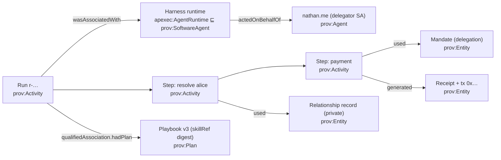

# What the A2A harness still needs — a prioritized feature program from a deep read of the field

**Status:** maintained (2026-09-09; prior snapshot 2026-09-05). Refreshed at the end of every harness wave — a
changed verdict lands here, in the competitive scorecard and in spec 351's layer table in the same change.
**Reads:** LangGraph 1.x OSS, LangSmith (Observability · Evaluation · Deployment/Agent Server · Engine ·
Fleet · Studio), Deep Agents, Microsoft Agent Framework (+ DurableTask extension, Foundry evaluators),
Dapr Agents ([deep dive](product-comparison/dapr-agents.md)), Buzz.xyz (assessed in spec 359 §3). The
Web3 / trust-substrate peers (Lit Vincent, ERC-8273/8001/8183, Inrupt, PROV-AGENT, AGNTCY…) are read in
[product-comparison/web3-agent-substrate-landscape.md](product-comparison/web3-agent-substrate-landscape.md);
its §4 takes feed Tier 0.3/0.4 (PROV alignment, OTel projection, hash-chained receipts) and spec 351's
contracts (`DigestBindingEnforcer` vs ERC-8273).
**Grounds:** [spec 359](../../specs/359-focus-program-playbooks-domains-durability.md) (the focus order
this document keeps), [spec 358](../../specs/358-semantic-context-plane.md) (semantic context plane; the
"knowledge plane lied" verdict), [spec 354](../../specs/354-archetype-driven-agent-behavior.md)
(playbooks), [spec 350](../../specs/350-authority-aware-agent-harness.md)/[351](../../specs/351-agentic-primitives-substrate-program.md),
[competitive analysis](agentic-framework-competitive-analysis.md).
**Update discipline:** a changed verdict updates the scorecard in the competitive analysis and spec 351's
layer table in the same change; priorities here never run ahead of spec 359's dependency chain.

---

## 0. Where we stand (honest snapshot, 2026-09-09)

The 2026-09-05 snapshot said "resume exists, durability does not", "provenance present but not the run's
system of record", "no trigger model", "K3–K4 not wired". All four are stale. Between 2026-09-06 and
2026-09-09: spec 370 P1–P8 shipped and were gated live on faithnet; specs 371–385 landed (fifteen specs,
most with W1–W2 live); spec 354 K4 is mostly live and K3 is live on the org, service and person pages;
and spec 366 R4/R5 put a **second deployment** live (`demo-a2a-faithnet` ↔ `demo-a2a-faithnet-b`, an
agent placed there by its name's records, never by a subdomain convention).

**Durable runs, triggers, provenance, streamed progress, memory, operators and external runtimes are all
live (370 P1–P8). The multi-agent rail is the differentiator (366–384): routed asks and writes across
Homes, hand-off as a child delegation, external A2A agents as steps, fan-out consult, committed steps run
at the participant, probe → offer → mandate.** Two Homes exist. The exposure is context management for
long runs, and the recurring-failure view.

Two honest corrections to "two Homes exist": the second Worker is live and the cross-Home routed read and
act are proven (spec 366 R5 gate), but B cannot read the shared vault until the key-custody pilot's
operator issues it a caller token, so a routed read that lands there answers "could not be read" — in B's
words, correctly — and the hand-off across deployments (376 W3) needs the parent agent's own session wire,
which no Worker holds yet. Spec 358's verdict still frames everything: **the authority plane held in every
incident; every defect was the knowledge plane telling a plausible falsehood.**

## 1. The deep read — what each product actually ships (relevant subset)

### 1.1 LangGraph (OSS runtime)
Checkpointers at **super-step boundaries** with durability modes (`sync` / `async` / `exit`); nodes
re-run from their start on resume, so idempotency is the author's job; `interrupt()` + `Command(resume=
…, goto=…, graph=PARENT)` for HITL and control flow; **Store** — cross-thread long-term memory with
namespaces and semantic search, separate from thread checkpoints; **node caching** (`key_func`, `ttl`);
**deferred nodes** (wait for all upstream branches — map-reduce/consensus); subgraphs with their own
checkpoint namespaces; time travel (fork from any checkpoint via thread history); typed streaming with
`reconnectOnMount`.

### 1.2 LangSmith (the control plane)
**Observability**: run trees, latency/cost/token, trace → local debugging in Studio. **Evaluation**:
datasets, experiments, online evaluators, production-trace promotion. **Deployment / Agent Server**:
assistants · threads · runs, durable run queue (Redis hot path + Postgres), stateless queue workers,
cron, webhooks, and — notable — **every deployed agent auto-exposed as an MCP endpoint**. **Engine**:
detects *recurring* failures across traces and proposes root causes. **Fleet**: no-code agent authoring.
OTEL/Prometheus metrics incl. rate-limit gauges.

### 1.3 Deep Agents (the harness)
Virtual filesystem with pluggable backends (state · store · disk · sandbox · **composite routing**, e.g.
`/memories/` durable, everything else thread-scoped); **AGENTS.md memory always loaded**; **SKILL.md
progressive loading**; `write_todos` planning; `task` subagents for **context isolation**; automatic
**summarization + offloading of large tool results**; prompt caching; `FilesystemPermission`
allow/deny/interrupt; `interrupt_on` per tool; Context Hub (agent repo + linked skill repos).

### 1.4 Microsoft Agent Framework
Graph workflows (sequential/concurrent/handoff/group) with checkpointing + time travel; **DurableTask
extension**: checkpoint after each step, distributed executors, days-long runs, a **dashboard with per-
executor timelines and step inputs/outputs**; native OTEL — GenAI semconv plus workflow spans
(`workflow.build`, `workflow.session`, `executor.process`, `edge_group.process`, `message.send`);
`AIContextProvider` + memory providers; Foundry evaluators (groundedness, tool-call accuracy, task
completion, safety) with production monitoring + alerts.

### 1.5 Dapr Agents · Buzz
Dapr: durable approval timer race, activity-output replay, resiliency policies — see the
[deep dive](product-comparison/dapr-agents.md). Buzz: triggers (message/reaction/schedule/webhook),
external runtimes as members via ACP, in-thread review — spec 359 §3.

## 2. Feature families — theirs, ours, verdict (revised 2026-09-09)

| Family | Field reference | Ours now | Verdict (was → is) |
| --- | --- | --- | --- |
| Authority | policy hooks / ACLs | per-step on-chain verify; chain-first verifier (`verifyAuthorityChain`, 383); child mandates single-use (376); value rail treasury-to-treasury (373) | ahead → **further ahead**: the chain is now on the receipt |
| Playbooks / skills | Deep Agents SKILL.md, Context Hub | K4 mostly live (definition by digest narrows offers, `skillRef` stamped); K3 ceremony live on org/service/person pages; specialists rule from archetype frontmatter (376 W2, live) | one wave from live → **live**; open: onboarding auto-assign, provenance manifest, K5 Ask ∩ definition |
| Durable runs | LangGraph checkpointer, MAF DurableTask, Dapr | P1: the checkpoint carries the admitted plan + completed steps; resume replays receipts and re-verifies only unrun steps; 30-min expiry; `DurableStepPort` + Workflows binding (362) | behind → **at par**, with the twist (resume re-verifies) |
| Traceability / provenance | LangSmith run trees, MAF timelines, OTEL | P6 + 381: `RunRecordV1`, replay re-derives verdicts, GenAI-semconv spans with an attribute firewall, OTLP export, `run.provenance:<runRef>` in the acting agent's vault, retention stated; **381 W3: the Home's Activities page lists an agent's runs and draws each as a timeline (steps, duration, authority decision, hand-off links), with a JSON download** | behind on ops → **at par on ops, ahead on evidence** |
| Streamed progress | LangGraph streams, A2A SSE | P2: run lines long-polled by the surface; cross-hop relay (M8) | **at par**; SSE deliberately not used |
| Long-term memory | LangGraph Store, Deep Agents `/memories/` | P7 `ConversationMemoryV1` in the vault; 385 scoped confirmation memory (pick-then-remember, context-scoped, correctable in the open); 358 W5 learned preferences | half-built → **at par**; open: standing-instructions record, acting-context namespacing beyond confirmations |
| Composition operators | deferred nodes, Send, subgraphs | P3: independent read-only steps batched, authority steps run alone; declared branches; fan-out consult (380, and the topic turn runs through it — W3); hand-off as child delegation (376) | behind → **at par on what matters**; no node caching, no sub-plans (deliberate, §5) |
| Triggers | LangSmith cron/webhooks, Buzz | P5 + 375: schedule / message / webhook / on-commitment fired live; authority steps suspend on the mandate | behind → **at par** |
| Multi-agent | MAF handoff/group chat, ADK RemoteA2aAgent, ACP | routed asks + writes across Homes (366, 374 W1–2), hand-off (376), external A2A agents as steps (379 W1–2), fan-out consult (380), committed steps at the participant (382), engagement probe → offer → mandate (384), outsiders as members + TCK green (372) | not scored before → **ahead in kind**; the field has no revocable, chain-verified hop |
| Context management | Deep Agents summarization/offload, prompt caching | none in harness/orchestration (the topic turn's own clipping only) | **behind** — the one row unchanged |
| Evaluation | LangSmith datasets/Engine, Foundry evaluators | truth cases + `check:ask-truth`; every wave has a live verify script + an authority twin | **at par in kind, thin**; no CI replay, no recurring-failure clustering |
| Model plane | MAF providers | 377: a second model behind the same planner port, Home picker, prompt budget fitted and traced | new row, **at par** |
| Semantic grounding | RAG add-ons | ontology-compiled plans, class-bound records, the answer answers the question (371) | **ahead**, unchanged |

### Where the gaps actually are now

Ordered by what the field has and we don't, not by what is unfinished:

1. **Context management for long runs** (Deep Agents, LangGraph summarization). No offload of large tool
   results to vault records, no history summarization at checkpoints, no isolated sub-run. Old Tier 1.3,
   now the biggest genuine "behind". The twist stands: a sub-run is a child delegation (376 gives the
   mechanism), an offloaded artifact is a receipted vault record.
2. **Recurring-failure detection** (LangSmith Engine). Nothing clusters refusals or truth-case failures
   across runs. Old 1.7, untouched.
3. **CI replay of the verify scripts** — every wave has a live script and an authority twin; nothing runs
   them as one suite or samples live asks.
4. **Second-deployment W3s**, half unblocked (B needs its caller token): 374 W3 routed write delivery
   across Homes, 376 W3 hand-off across deployments + live revocation twin, 383 W3 bilateral bindings,
   379 W2 positive REACH twin (a registered outside name — Ligonier is the candidate), 379 W3 reverse.
5. **Playbook tails**: onboarding auto-assign, K5, provenance manifest.
6. **Endeavor conformance** (382 W3: decisions by declared approvers wait on spec 333's `RecordDecision`;
   the Coordinator driving offers and allocations through the Ask as a live twin; milestones ✅).

## 3. The prioritized program (re-cut 2026-09-09)

### Tier 0 — now

| # | Feature | Analog | Our twist / gate |
| --- | --- | --- | --- |
| **0.1** | **Context management for long runs** (was 1.3) — large tool results become receipted vault records and the plan carries a reference; run history summarized at checkpoints; heavy sub-work runs as a child hand-off (376) so it never pollutes the parent's context | Deep Agents offload/summarize/subagent | spec first: it defines what a checkpoint holds |
| **0.2** | **CI replay of the verify scripts + authority twins** (was 0.5) — one job, the negative twin beside every positive | LangSmith Engine (in kind) | protects the lead while features keep landing |
| ~~0.3~~ | ~~Home "How and why" timeline from `run.provenance`~~ — **✅ 2026-09-09 (381 W3)**: Activities lists the runs, each opens as a timeline, JSON download | LangSmith trace UI, MAF DTS dashboard | done |

### Tier 1 — next

| # | Feature | Note |
| --- | --- | --- |
| **1.1** | The second-deployment W3s as ONE wave on one fixture (faithnet-b): 374 W3, 376 W3 + live revocation twin, 383 W3, 379 W2/W3 | after B's AKCS caller token (pilot operator) |
| **1.2** | Playbook tails: onboarding auto-assign, K5 Ask ∩ definition, provenance manifest | housekeeping |
| **1.3** | Endeavor conformance: decisions by declared approvers (needs 333's `RecordDecision`), the Coordinator's offers/allocations through the Ask as a live twin | 382 W3 rolling |

### Tier 2 — later

| # | Feature | Note |
| --- | --- | --- |
| 2.1 | Recurring-failure clustering — deterministic, over `RunProvenanceV1` | old 1.7 |
| 2.2 | Standing-instructions memory record; acting-context namespacing beyond confirmations | after 385 |
| 2.3 | DO economics for background runs at scale | unchanged |
| 2.4 | No-code playbook authoring | unchanged; the `~/skills` web app is the seat |

## 4. Traceability and provenance — why PROV-O is the lever, not just a nicety

> **2026-09-09:** the "gap is wiring, not design" paragraph below is done — `provenanceOf` runs after every recorded run and lands in the acting agent's vault, and the Home renders it (381 W3). The remaining gap is querying it for failure clusters.

Every framework in §1 answers "what happened" with a **trace**: spans, inputs/outputs, a timeline —
ops-facing, vendor-shaped, and detached from authority. We already hold the pieces to answer four
questions no trace answers, in one W3C-standard graph:

| Question | PROV-O shape | Source we already have |
| --- | --- | --- |
| *What was done, in what order?* | `prov:Activity` (run) ⟶ sub-activities (steps), `prov:wasInformedBy` | orchestration step model |
| *Under whose authority?* | `prov:actedOnBehalfOf` (harness runtime → delegator SA), `prov:used` the mandate | delegation + `apexec:AuthorityDecision` |
| *Following what procedure, which version?* | `prov:qualifiedAssociation` / `prov:hadPlan` = the compiled playbook, pinned by `skillRef` digest | 354 K4, `skill-provenance/v1` |
| *What did it read, and what did it produce?* | `prov:used` context records (with tier); `prov:generated` receipts, artifacts, vault writes | 356/358 `AskEvidence`, receipts |

What this buys that a trace cannot: the same graph is **the audit** (who/why/what-version), **the debug
view** (Home timeline), **the eval substrate** (truth probes and authority twins query it), and **the
evidence** (receipts are nodes in it, anchorable). It is private by default (asker's vault) and only
crosses to the public KB through the S1 firewall (on-chain-anchored, no attribution, no plaintext) —
the ADR-0040 line, already enforced in `provenance/firewall.ts`.

The gap is wiring, not design: `projectRunProvenance` exists and is not called by `harness-run.ts`;
`AskEvidence` is a flat slice rather than a projection of the graph; there is no exporter. Tier 0.3 and
0.4 close it, and they should land **before** the compiler multiplies the number of domains whose runs
we will need to explain.

## 5. What we deliberately do not adopt

- **Agent-as-MCP-endpoint** (LangSmith Deployment's default). MCP is our *private* capability interface;
  the public peer surface is A2A with a signed, SA-bound card (ADR-0057, spec 347). Recorded so the
  convenience doesn't drift in.
- **Filesystem permissions or tool allowlists as authority** (Deep Agents `FilesystemPermission`,
  `interrupt_on`). Ours are honesty/scope; the mandate is authority (spec 353 §4).
- **Client-held approvals** as the boundary — approvals are signed records + obligations.
- **A run UI or workflow vendor in Ring 0** (351 §9) — data and events here; rendering and engines outside.
- **Group chat / swarm parity** — coordination plane or not at all (ADR-0054).
- **Node caching for side-effecting steps** — a receipt is the record of a step that ran; re-running is a new run.
- **SSE for progress** — long-poll chosen; the surface reads run lines, the Worker holds nothing open.

## 6. Sequencing, restated as one line each

0.1 context management (spec, then offload + summarize + child sub-runs) → 0.2 CI replay of the verify
scripts and their authority twins → 1.1 the four second-deployment W3s as one wave once B holds its
caller token → 1.2 playbook tails → 1.3 the rest of Endeavor conformance → Tier 2. The "run well" gap is
closed; what remains is to handle long runs without drowning in context, lock the gains down, and finish
the cross-Home proofs the second deployment made possible.
