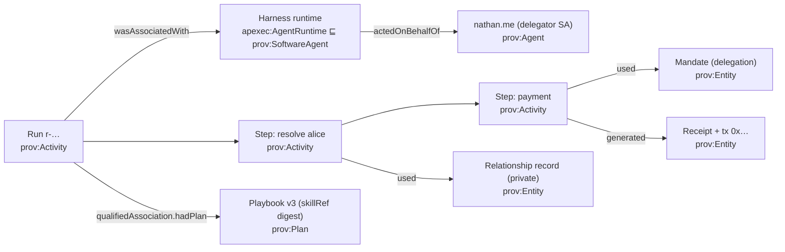

# What the A2A harness still needs — a prioritized feature program from a deep read of the field

**Status:** maintained (2026-09-05).
**Reads:** LangGraph 1.x OSS, LangSmith (Observability · Evaluation · Deployment/Agent Server · Engine ·
Fleet · Studio), Deep Agents, Microsoft Agent Framework (+ DurableTask extension, Foundry evaluators),
Dapr Agents ([deep dive](product-comparison/dapr-agents.md)), Buzz.xyz (assessed in spec 359 §3). The
Web3 / trust-substrate peers (Lit Vincent, ERC-8273/8001/8183, Inrupt, PROV-AGENT, AGNTCY…) are read in
[product-comparison/web3-agent-substrate-landscape.md](product-comparison/web3-agent-substrate-landscape.md);
its §4 takes feed Tier 0.3/0.4 (PROV alignment, OTel projection, hash-chained receipts) and spec 351's
contracts (`DigestBindingEnforcer` vs ERC-8273).
**Grounds:** [spec 359](../../specs/359-focus-program-playbooks-domains-durability.md) (the focus order
this document keeps), [spec 358](../../specs/358-semantic-context-plane.md) (semantic context plane; the
"knowledge plane lied" verdict), [spec 354](../../specs/354-archetype-driven-agent-behavior.md)
(playbooks), [spec 350](../../specs/350-authority-aware-agent-harness.md)/[351](../../specs/351-agentic-primitives-substrate-program.md),
[competitive analysis](agentic-framework-competitive-analysis.md).
**Update discipline:** a changed verdict updates the scorecard in the competitive analysis and spec 351's
layer table in the same change; priorities here never run ahead of spec 359's dependency chain.

---

## 0. Where we stand (honest snapshot, 2026-09-05)

The A2A harness now runs with: archetype-derived behavior from `~/skills` (`archetype-skill.ts`), and —
as of the evening of 2026-09-05 — **the playbook compiler loop's two ends built and proven** (spec 354
K1–K2): the Ring-0 schemas (`SkillExecutionContractV1`, `AgentHarnessDefinitionV1`,
`ArchetypeAssignmentV1` in `capability-claims` via the `agent-skills` shim) whose validator *refuses* any
signature, delegator or caveat in a playbook body — the "behavior ≠ authority" invariant as a tripwire —
and `@skills/archetype-compiler`, which compiles the design-time `AgentArchetype` (skills · ADR-0051
capabilities · covered knowledge classes · kind) into a definition whose digest matches the Ring-0
validator byte for byte, with capabilities carrying their authority shape from one profile and unprofiled
capabilities failing safe to informational. `archetypes/treasury-steward` compiles to the same shape as
the hand-built treasury Ask (`applicableAgentTypes=[treasury]`, payment tool at `risk=high`). What is
**not** built: K3 (Home fetches the definition, previews the diff, writes `ArchetypeAssignmentV1` to the
agent's vault pinned to the digest — editor ≠ approver ≠ writer) and K4 (run admission loads by digest
and builds the harness from the definition instead of the hand-built tool list). Two honest tails: the
compiler mirrors the schema until `capability-claims` publishes past alpha.19, and the Treasury archetype
is proven locally, not yet seeded into live GraphDB. Memory and records are held in MCP vaults, read
through the **semantic context plane** (specs 355–358, W1–W6 shipped: ontology-compiled party
resolution, class-bound vault records, generated SPARQL over the public KB, `AskEvidence` in every
reply); intent-driven **Endeavors** (specs 332–334) with authority steps; a planner + orchestration loop
whose every consequential step is gated by delegation · entitlement · caveat · per-step on-chain verify
(350 W1–W2, live); a checkpoint in the asked agent's `A2aTaskDO` (350 W3 — *resume exists, durability
does not*: a 4-payment ask took 13 client-held turns); a `provenance` package that projects runs and
exchanges into a PROV-O / P-Plan A-box with a fail-closed public firewall — **present but not yet the
run's system of record**; an `evaluation` package with the truth-case contract (358 W2) and
`check:ask-truth`.

Spec 358's verdict frames everything below: **the authority plane held in every incident; every defect
was the knowledge plane telling a plausible falsehood.** The moat is authority. The exposure is truth,
durability, and the ability to *see* what a run did — which is exactly where the field's leaders spend.

## 1. The deep read — what each product actually ships (relevant subset)

### 1.1 LangGraph (OSS runtime)
Checkpointers at **super-step boundaries** with durability modes (`sync` / `async` / `exit`); nodes
re-run from their start on resume, so idempotency is the author's job; `interrupt()` + `Command(resume=
…, goto=…, graph=PARENT)` for HITL and control flow; **Store** — cross-thread long-term memory with
namespaces and semantic search, separate from thread checkpoints; **node caching** (`key_func`, `ttl`);
**deferred nodes** (wait for all upstream branches — map-reduce/consensus); subgraphs with their own
checkpoint namespaces; time travel (fork from any checkpoint via thread history); typed streaming with
`reconnectOnMount`.

### 1.2 LangSmith (the control plane)
**Observability**: run trees, latency/cost/token, trace → local debugging in Studio. **Evaluation**:
datasets, experiments, online evaluators, production-trace promotion. **Deployment / Agent Server**:
assistants · threads · runs, durable run queue (Redis hot path + Postgres), stateless queue workers,
cron, webhooks, and — notable — **every deployed agent auto-exposed as an MCP endpoint**. **Engine**:
detects *recurring* failures across traces and proposes root causes. **Fleet**: no-code agent authoring.
OTEL/Prometheus metrics incl. rate-limit gauges.

### 1.3 Deep Agents (the harness)
Virtual filesystem with pluggable backends (state · store · disk · sandbox · **composite routing**, e.g.
`/memories/` durable, everything else thread-scoped); **AGENTS.md memory always loaded**; **SKILL.md
progressive loading**; `write_todos` planning; `task` subagents for **context isolation**; automatic
**summarization + offloading of large tool results**; prompt caching; `FilesystemPermission`
allow/deny/interrupt; `interrupt_on` per tool; Context Hub (agent repo + linked skill repos).

### 1.4 Microsoft Agent Framework
Graph workflows (sequential/concurrent/handoff/group) with checkpointing + time travel; **DurableTask
extension**: checkpoint after each step, distributed executors, days-long runs, a **dashboard with per-
executor timelines and step inputs/outputs**; native OTEL — GenAI semconv plus workflow spans
(`workflow.build`, `workflow.session`, `executor.process`, `edge_group.process`, `message.send`);
`AIContextProvider` + memory providers; Foundry evaluators (groundedness, tool-call accuracy, task
completion, safety) with production monitoring + alerts.

### 1.5 Dapr Agents · Buzz
Dapr: durable approval timer race, activity-output replay, resiliency policies — see the
[deep dive](product-comparison/dapr-agents.md). Buzz: triggers (message/reaction/schedule/webhook),
external runtimes as members via ACP, in-thread review — spec 359 §3.

## 2. Feature families — theirs, ours, verdict

| Family | Field reference | Ours today | Verdict |
| --- | --- | --- | --- |
| Authority (mandate, per-step verify, revocation, attenuation, intent binding) | policy hooks / interventions / ACLs | live on chain | **ahead** — unchanged |
| Playbooks / skills | Deep Agents SKILL.md progressive load; Context Hub | schemas + compiler shipped (354 K1–K2); Treasury archetype compiles clean; assignment ceremony + run admission (K3–K4) not wired | **ahead in design, one wave from live** — the multiplier exists, agents don't run under it yet (359 §1) |
| Durable runs | LangGraph checkpointer; MAF DurableTask; Dapr | checkpoint exists; state client-held per turn | **behind** — the scorecard's biggest "behind" |
| **Traceability / provenance** | LangSmith run trees; MAF DTS timelines; OTEL GenAI semconv | `provenance` pkg (PROV-O/P-Plan) + `AskEvidence`; not wired to every run; no exporter; no timeline UI data | **behind on ops, ahead in potential** — nobody else has standards-based, queryable, evidential provenance (§4) |
| Long-term memory | LangGraph Store (namespaces, semantic search); Deep Agents `/memories/`, AGENTS.md | vault-resident memory shipped (358 W5: `apctx:LearnedPreference` class-bound records in the OWNER's vault, read through the same selector, shown in evidence, owner-deletable); no acting-context namespacing or standing-instructions record yet | **at par on doctrine, contract half-built** |
| Context management | Deep Agents summarization/offload/subagent isolation; prompt caching | none beyond the planner's menu | **behind** — bites on long Endeavors |
| Evaluation | LangSmith datasets/experiments/Engine; Foundry evaluators | truth cases + `check:ask-truth`; authority twins as scripts | **at par in kind, thin in coverage** |
| Composition operators | deferred nodes, node caching, subgraphs, `Command.goto` | ontology-compiled fan-out live for payments (358 W4 + W4-tail 2026-09-05: "pay each member 21 usdc" settles s1#1..#4; the identical re-ask completes `done` because idempotency is the on-chain single-use nonce, not a client id); no join / map-reduce / caching / sub-plan operators | **behind on generality, ahead on idempotency** |
| Triggers / background | LangSmith cron + webhooks; Buzz triggers | `A2aTaskDO` alarms; no trigger model | **behind** (359 F5a) |
| Control plane / deployment | Agent Server (queue workers, MCP endpoint per agent) | per-agent Workers/DOs | different substrate; **deliberately no run UI in Ring 0** |
| Semantic knowledge grounding | RAG add-ons; opaque context providers | ontology-bound records, grounded SPARQL, evidence in reply | **ahead** (358 §1) |

## 3. The prioritized program

Tiered, with owner, framework analog, and the twist that keeps each item ours. Tier 0 is spec 359's
chain as written plus the two items this read adds to it (provenance, semantic events) because they are
cheap now and expensive later.

### Tier 0 — now (sequence is a dependency chain)

| # | Feature | Owner | Analog | Our twist / gate |
| --- | --- | --- | --- | --- |
| **0.1** | **Playbook compiler loop — close it.** K1–K2 ✅ (schemas with the authority-refusal validator; `@skills/archetype-compiler`; Treasury archetype validated cross-repo, digest byte-identical). **Next: K3** — Home fetches `GET …/archetypes/:aid/definition` via `skills-a2a`, previews the diff (skills gained/lost, tools exposed, mandate types the agent would start asking for), and writes `ArchetypeAssignmentV1` to the agent's vault pinned to the digest, editor ≠ approver ≠ writer; **then K4** — the a2a worker reads the assignment, verifies the commitment, builds the harness from the definition instead of the hand-built tool list; `skillRef` on receipts; **K5** Ask ∩ definition. Tails: seed treasury-steward into live GraphDB; direct schema import once `capability-claims` publishes; corpus leaf for compiled definitions | `capability-claims`/`agent-skills` ✅, `~/skills` ✅, **Home + `demo-a2a` (K3–K4 next)** | Deep Agents SKILL.md progressive load + Context Hub; Pydantic deferred skills | playbook ≠ authority — now *enforced by the validator*, not asserted (354 §1); gate for K3–K4 = Treasury→Bookkeeper reassignment removes the *offer* while every mandate gate stays identical |
| **0.2** | **Durable runs on `A2aTaskDO`** — plan · refs · keyring mandates · supplied answers · receipts on the DO; per-step checkpoint; **resume-with-recheck**; durable approvals via alarm race; `runRef` as the only handle (turn N sends only what is new) | `a2a`, `harness`, `demo-a2a` | LangGraph checkpointer + `Command(resume)`; MAF DurableTask per-step checkpoint; Dapr `when_any` race | effects replay from receipts, **verdicts re-derive** (351 P1.5); a checkpoint is never authority; gate = the 4-payment fan-out in ≤ N short turns |
| **0.3** | **Run provenance as the system of record** — every harness run projects to the PROV-O/P-Plan A-box via `provenance.projectRunProvenance` and lands in the *asker's vault*; the run is `prov:Activity`, steps are sub-activities, `prov:qualifiedAssociation/hadPlan` = the playbook version (`skillRef`), `prov:used` = mandate + context records read, `prov:generated` = receipts/artifacts, `prov:actedOnBehalfOf` = the delegator SA. Queryable through the 356 selector like any class-bound record. Home's "How" pane (358) becomes a **"How and why" timeline** fed from it | `provenance`, `harness`, `demo-mcp`, Home | LangSmith run trees; MAF DTS executor timelines | standards-based (W3C PROV), **queryable** (SPARQL over the private A-box), **evidential** (the receipt and the trace are the same graph), firewalled from the public KB (S1). §4 details |
| **0.4** | **Semantic `RunEvent` emission + Ring-1 OTEL exporter** — emit 350 §9's vocabulary (AskReceived · EntityResolved · MandateVerified/Denied · ApprovalRequested · ToolInvoked · CheckpointSaved · ReceiptCreated · RunCompleted…) with run/step/intent/mandate refs on every event; exporter maps to GenAI semconv + MAF-style workflow spans | `audit`, `demo-a2a`; exporter in a sibling repo (ADR-0037) | MAF OTEL spans; LangSmith traces; Agent Server Prometheus metrics | events are derived from the provenance projection (one source), never a second story; the exporter is glue, the vocabulary is Ring 0 |
| **0.5** | **Evaluation coverage** — every incident → a truth case (358 rule, enforced); the authority twins (351 §7.9) as replayed cases in CI; online sampling of live asks against the truth probes | `evaluation`, `demo-a2a` scripts | LangSmith datasets/experiments + online evals; Foundry groundedness/tool-call-accuracy | deterministic judges only (358: "no model judges a model here"); the interesting rows are authority properties |

### Tier 1 — next (after 0.1–0.2 land; 359 #4–6 plus what this read adds)

| # | Feature | Owner | Analog | Our twist |
| --- | --- | --- | --- | --- |
| **1.1** | **Work & Planning as a compiled playbook** — Coordinator archetype; "what am I working on / propose a plan / allocate / mark milestone"; **no new invoker code** (359 §2 gate) | `~/skills`, `coordination`, `demo-a2a` | MAF/Buzz task surfaces | between-agent stays coordination plane (ADR-0054) |
| **1.2** | **Long-term memory contract** — memory = class-bound vault records under delegation, namespaced by *acting context* (person / org / workspace), retrieved with evidence, with retention/forget rules; an always-loaded per-agent "standing instructions" record (the AGENTS.md idea) as part of the compiled definition | `context`, `demo-mcp`, `agent-skills` | LangGraph Store namespaces + semantic search; Deep Agents `/memories/` + AGENTS.md | memory informs phrasing and planning, **never authority** (352 §7); cross-tier leakage is a defect (ADR-0025) |
| **1.3** | **Context management for long runs** — offload large tool results to vault records (not the DO), summarize run history at checkpoint boundaries, isolate heavy sub-work (a sub-run with its own child mandate, results only) | `harness`, `orchestration`, `demo-mcp` | Deep Agents summarization/offloading/subagent isolation; prompt caching | offloaded artifacts are receipted vault records; a sub-run is a **child delegation**, never an in-process subagent with inherited authority |
| **1.4** | **Triggers (F5a)** — playbook-declared automations (on message / schedule / webhook) as a definition field + `A2aTaskDO` alarm; informational steps run free, authority-bearing steps suspend on their mandate | `agent-skills`, `a2a`, `demo-a2a` | LangSmith cron/webhooks; Buzz triggers | needs 0.2 first; a trigger never carries a standing mandate for value-moving steps |
| **1.5** | **Composition operators** — parallel fan-out + join (deferred-node semantics), map-reduce over resolved parties, **node caching for informational steps only**, sub-plans | `orchestration` | LangGraph deferred nodes, node caching, subgraphs | each operator receipted + authority-checked; caching is forbidden for side-effecting steps (a substituted result needs a receipt saying so) |
| **1.6** | **Replay / fork from a checkpoint** — fork a run at step N with re-derived verdicts; diff two runs | `evaluation`, `provenance` | LangGraph time travel; MAF time travel | replay re-runs the verifier against recorded state; verdicts are never replayed |
| **1.7** | **Recurring-failure detection** — cluster refusals, `ask.unsupported` picks and truth-case failures across runs; surface as candidate cases and playbook fixes | `evaluation`; UI in the UX repo | LangSmith Engine | deterministic clustering over provenance facts (tool id, refusal code, capability), no model judge |

### Tier 2 — later

| # | Feature | Analog | Note |
| --- | --- | --- | --- |
| 2.1 | External runtimes as admitted members (F5b, ACP) | Buzz | Ring 1 protocol half; Ring 0 contributes admission + delegation (359 §6) |
| 2.2 | A2A streaming + resubscribe for long runs; reconnect in Home | LangGraph `reconnectOnMount`; Mastra | 351 P0.9 TCK work |
| 2.3 | Model routing / fallback / prompt caching | MAF providers; Deep Agents | confined to `orchestration-anthropic` |
| 2.4 | Deployment control-plane parity (queue workers, background runs at scale) | LangSmith Agent Server | measure DO economics first (Dapr deep dive G7); `durable-executor` ports Wave G |
| 2.5 | No-code playbook authoring | LangSmith Fleet | the `~/skills` web app is the seat; out of Ring 0 |

## 4. Traceability and provenance — why PROV-O is the lever, not just a nicety

Every framework in §1 answers "what happened" with a **trace**: spans, inputs/outputs, a timeline —
ops-facing, vendor-shaped, and detached from authority. We already hold the pieces to answer four
questions no trace answers, in one W3C-standard graph:

| Question | PROV-O shape | Source we already have |
| --- | --- | --- |
| *What was done, in what order?* | `prov:Activity` (run) ⟶ sub-activities (steps), `prov:wasInformedBy` | orchestration step model |
| *Under whose authority?* | `prov:actedOnBehalfOf` (harness runtime → delegator SA), `prov:used` the mandate | delegation + `apexec:AuthorityDecision` |
| *Following what procedure, which version?* | `prov:qualifiedAssociation` / `prov:hadPlan` = the compiled playbook, pinned by `skillRef` digest | 354 K4, `skill-provenance/v1` |
| *What did it read, and what did it produce?* | `prov:used` context records (with tier); `prov:generated` receipts, artifacts, vault writes | 356/358 `AskEvidence`, receipts |

What this buys that a trace cannot: the same graph is **the audit** (who/why/what-version), **the debug
view** (Home timeline), **the eval substrate** (truth probes and authority twins query it), and **the
evidence** (receipts are nodes in it, anchorable). It is private by default (asker's vault) and only
crosses to the public KB through the S1 firewall (on-chain-anchored, no attribution, no plaintext) —
the ADR-0040 line, already enforced in `provenance/firewall.ts`.

The gap is wiring, not design: `projectRunProvenance` exists and is not called by `harness-run.ts`;
`AskEvidence` is a flat slice rather than a projection of the graph; there is no exporter. Tier 0.3 and
0.4 close it, and they should land **before** the compiler multiplies the number of domains whose runs
we will need to explain.

## 5. What we deliberately do not adopt

- **Agent-as-MCP-endpoint** (LangSmith Deployment's default). MCP is our *private* capability interface;
  the public peer surface is A2A with a signed, SA-bound card (ADR-0057, spec 347). Recorded so the
  convenience doesn't drift in.
- **Filesystem permissions or tool allowlists as authority** (Deep Agents `FilesystemPermission`,
  `interrupt_on`). Ours are honesty/scope; the mandate is authority (spec 353 §4).
- **Client-held approvals** as the boundary — approvals are signed records + obligations.
- **A run UI or workflow vendor in Ring 0** (351 §9) — data and events here; rendering and engines outside.
- **Group chat / swarm parity** — coordination plane or not at all (ADR-0054).

## 6. Sequencing, restated as one line each

0.1 compiler (K1–K2 done → K3 ceremony → K4 run admission) → 0.2 durable runs → 0.3 provenance record + 0.4 events (cheap now, before domains multiply)
→ 0.5 eval coverage as the acceptance gate → 1.1 Work & Planning playbook → 1.2–1.3 memory + context
management → 1.4 triggers (needs durable runs) → 1.5–1.7 operators, replay, failure detection → Tier 2.
Same chain as spec 359, with provenance and events inserted where they are cheapest.
