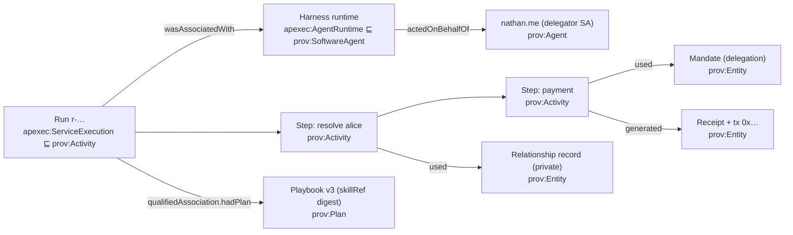

# The A2A harness against the field — the defensible position, the provenance audit, and what goes next

**Status:** maintained (re-audited 2026-09-09 evening; prior snapshots 2026-09-05, 2026-09-09 noon). Refreshed at
the end of every harness wave — a changed verdict lands here, in the competitive scorecard and in spec 351's
layer table in the same change.
**Reads:** LangGraph 1.x OSS, LangSmith (Observability · Evaluation · Deployment/Agent Server · Engine ·
Fleet · Studio), Deep Agents, Microsoft Agent Framework (+ DurableTask extension, Foundry evaluators),
Dapr Agents ([deep dive](product-comparison/dapr-agents.md)), Buzz.xyz (assessed in spec 359 §3), Google ADK,
OpenAI Agents SDK, Mastra, Strands (per-framework standing in the
[competitive analysis](agentic-framework-competitive-analysis.md) §2). The Web3 / trust-substrate peers (Lit
Vincent, ERC-8273/8001/8183, Inrupt, PROV-AGENT, AGNTCY…) are read in
[product-comparison/web3-agent-substrate-landscape.md](product-comparison/web3-agent-substrate-landscape.md).
The eight-area parity ledger with per-wave evidence is
[product-comparison/harness-parity-gap-analysis.md](product-comparison/harness-parity-gap-analysis.md) (spec 370).
**Standards read for §4:** W3C PROV family (PROV-DM, PROV-O, PROV-N, PROV-CONSTRAINTS, PROV-AQ, PROV-Links/bundles),
P-Plan, EP-Plan, OPMW, PROV-AGENT (2025), OpenTelemetry GenAI semantic conventions (agent + framework spans,
status *Development* as of 2026-09), W3C Trace Context, OTLP, VC Data Integrity, in-toto/SLSA attestations, C2PA.
**Grounds:** [spec 359](../../specs/359-focus-program-playbooks-domains-durability.md), [spec 358](../../specs/358-semantic-context-plane.md),
[spec 354](../../specs/354-archetype-driven-agent-behavior.md), [spec 350](../../specs/350-authority-aware-agent-harness.md)/[351](../../specs/351-agentic-primitives-substrate-program.md),
[spec 381](../../specs/381-run-export-spans-retention-provenance.md), [spec 383](../../specs/383-the-chain-on-the-receipt.md),
[spec 316 §6](../../specs/316-agentic-interaction-fabric.md) (PROV-O / P-Plan grounding + SHACL S1–S5).

---

## 0. Where we stand (honest snapshot, 2026-09-09)

Between 2026-09-06 and 2026-09-09: spec 370 P1–P8 shipped and were gated live on faithnet; specs 371–388
landed (eighteen specs, most with W1–W2 live); spec 354 K4 is mostly live and K3 is live on the org, service
and person pages; spec 366 R4/R5 put a **second deployment** live (`demo-a2a-faithnet` ↔ `demo-a2a-faithnet-b`,
an agent placed there by its name's records, never by a subdomain convention); spec 381 W3 put the run
timeline on the Home; specs 386/387 put the first **outside-in** path live end to end (Claude.ai → the
Global.Church gateway connector → the registry → Ligonier's own A2A agent → the content MCP its name record
points at → a six-week study as the task's artifact), instrumented with a flow trace on every hop
([outside-in-flow-claude-gateway-a2a-catalog.md](outside-in-flow-claude-gateway-a2a-catalog.md)); spec 388
put budget-routed model selection live (a route decided before the call and recorded with its reason);
388 W3 (later 2026-09-10) made the minute a deployment-wide fact (`ProviderMeterDO`, read-and-charge in one
step, named on the trace) and wired a third provider — OpenAI `gpt-5-mini` between the free tier and Haiku —
which the first live call proved is refused with `credit_balance_exhausted` until that account is funded, and
the route surfaced rather than skipped (ADR-0013): it is off the live offer, one var from on.
**Specs 389 + 390 (2026-09-10) closed most of §4.3:** the run's vault record IS the graph (389 W1 — JSON-LD under a
published context, one `ep-plan:ExecutionTraceBundle` per run, the runtime `actedOnBehalfOf` the agent, each step
`usedDelegation` its mandate and `used` every chain link, `generated` receipt / tx / effects / decisions, the bundle
`wasInformedBy` the sender's; 44 fields bound by IRI; round-tripped by a stock RDF stack); validity R1–R6 in CI with
the forged / truncated / leaking twins refused by name (389 W2); every span names its PROV activity and every activity
its span (390 W1); W3C Trace Context in and out — Claude → gateway → Ligonier's agent recorded as one trace (390 W2).
Specs 389 and 390 are both complete (390 W4, 2026-09-10: span events and the four metrics beside the traces). What remains of §4 is Ring-1's: an SDK exporter with batching / gRPC / propagators (351 §2.3), and the two-Home form of the routed-run gate once B holds its caller token (1.1). One correction to §4.3: the SHACL file it cited never existed.

**Durable runs, triggers, provenance, streamed progress, memory, operators and external runtimes are all
live (370 P1–P8). The multi-agent rail is the differentiator (366–384): routed asks and writes across Homes,
hand-off as a child delegation, external A2A agents as steps, fan-out consult, committed steps run at the
participant, probe → offer → mandate.** Two Homes exist, with two honest corrections: B cannot read the shared
vault until the key-custody pilot's operator issues it a caller token (a routed read that lands there answers
"could not be read", in B's words, correctly), and the hand-off across deployments (376 W3) needs the parent
agent's own session wire, which no Worker holds yet.

Spec 358's verdict still frames everything: **the authority plane held in every incident; every defect was the
knowledge plane telling a plausible falsehood.** The exposure is context management for long runs, the
recurring-failure view, and — this audit's finding — a provenance record that is PROV-*shaped* but not yet
PROV-*serialized*, *validated* or *queryable* (§4).

## 1. The defensible position — how this harness is better, stated so it can be checked

"Better" is not a scorecard total. The frameworks in §2 are better than us at several things (§1.2). The
position that holds is narrower and stronger: **on the properties that decide whether an agent can be trusted
to act, this harness is contract-enforced where every other framework is policy code — and each property
comes with a test a skeptic can run.** Five claims, each with its evidence and the experiment that would
falsify it.

### 1.1 Five claims

| # | Claim | What the field does instead | Our evidence (shipped) | The falsifier — how a skeptic checks it |
| --- | --- | --- | --- | --- |
| **C1** | **Authority is a verified fact per step, not a branch in policy code.** Every consequential step presents a mandate (a delegation + intent-digest caveat) that is verified on chain, single-use, attenuable, revocable — before the step, and again after a human approval. | MAF/LangGraph/Strands: `interrupt()`, middleware, hooks, allow-lists — checked in the process that also runs the model; nothing outside the runtime can revoke a step in flight | 350 W1–W2 live; P1 resume re-verifies only unrun steps; 383 chain-first verifier (`verifyAuthorityChain`); 376 child mandates single-use; 373 value rail | Revoke the mandate on chain mid-run: the next step is denied and the receipt says why. Present a forged child without its parent: `chain-parent-missing` before any caveat is read. Both are live scripts (`verify-authority-chain.mts`, `verify-handoff.mts`) |
| **C2** | **Identity survives the runtime.** The agent IS a Smart Agent address; the runtime (`apexec:AgentRuntime ⊑ prov:SoftwareAgent`) `actedOnBehalfOf` it; the model is swappable without changing who is answerable; a service signs as an identity only through a revocable delegate wire (never custodying it). | Identity = a config object inside the framework; a runtime restart or a vendor change is an identity change; keys live with the service | ADR-0010/0046; service-agent signing rule (ADR-0019); 372 S4 one wire; 377/388 model swapped and routed under the same agent, the route on the trace | Rotate the model provider (377) or the credential (spec 221): every prior delegation still verifies and every receipt still attributes to the same address |
| **C3** | **Every consequential step leaves evidence a third party can verify without trusting the agent.** Receipt digest, input/output digests, the mandate by reference, the chain digest, and — for value — the tx hash; the run's provenance lands in the acting agent's own vault, with a stated retention. | Traces in a vendor platform (LangSmith, Foundry): rich, but readable only by the operator and evidential only if you trust the operator | 370 P6 `RunRecordV1` + replay re-deriving verdicts; 381 spans with an attribute firewall, OTLP export, `run.provenance:<runRef>`; 381 W3 timeline on the Home | Take a receipt and its tx hash to a chain explorer and the delegation registry: the payer, the mandate, and the revocation state are checkable with none of our code running |
| **C4** | **A hop between agents is a governed act, not a function call.** A routed ask re-derives standing at the receiver under *its* playbook and record; a hand-off is a child delegation cut from the parent mandate; an outside A2A agent's answer is an observation, never authority; the chain on the receipt names every actor and grant. | MAF handoff / ADK `RemoteA2aAgent` / OpenAI handoffs: control transfer with inherited context; the callee trusts the caller's process | 366 R0–R5 live across two Homes; 374 W1–2; 376 W1–2; 379 W1–2; 380; 382; 383 W1–2; 384 W1–4 | Ask the org's agent for its roster from a person with no standing: refused *by the receiver*. Hand a step to a specialist and re-present the same child for a second step: denied (single use) |
| **C5** | **Knowledge is ontology-bound and the answer states its evidence.** Domain shape lives in the T-box and is bound by IRI (`check:ontology-bindings`); vault questions compile to selectors, KB questions to grounded SPARQL; every reply carries `AskEvidence` naming what was read and from which tier. | Prompt-resident domain rules and RAG add-ons; grounding is a model's claim | specs 355–358 W1–W6; 371 (the answer answers the question); `check:ask-truth` | Ask a question whose answer is not in either tier: the reply says so and names the tiers it read, instead of a plausible falsehood |

The claims compose: C1 without C2 is a policy engine; C3 without C1 is a trace; C4 without C3 is a swarm; C5
without C3 is RAG. Together they are one property — **a run whose authority, identity, evidence, hops and
knowledge are all facts a third party can verify** — and no framework in §2 has all five, or claims to.

### 1.2 Where they are better, and how the position survives it

| They lead on | Who | Our honest state | How we argue it (and what we build) |
| --- | --- | --- | --- |
| Context management for long runs | Deep Agents (offload, summarize, subagent isolation), LangGraph | none in `harness`/`orchestration` | Not a trust property; adopt the mechanisms with the twist (offloaded artifact = receipted vault record; sub-run = child delegation). **P1 below.** |
| Developer experience, ecosystem, examples | LangGraph, Mastra, OpenAI SDK | small; one estate; TypeScript only | A consequence of being a substrate, not a framework; the outside-in path (386/387) is the first "consume it from a third-party host" proof |
| Evaluation platforms with model judges | LangSmith, Foundry | deterministic truth cases only; no CI replay of the live scripts | Deliberate for authority (no model judges a model); the gap that matters is coverage and CI, **P2** |
| Ops at scale, queue workers, run UIs | LangSmith Agent Server, MAF DTS dashboard | per-agent Workers/DOs; the Home timeline (381 W3) | Different substrate; the run UI in Ring 0 is a non-goal (351 §9); measure DO economics before copying |
| Tracing ergonomics (Studio, live debugging) | LangSmith, Logfire | spans + OTLP, firewalled; timeline on the Home | We export to *their* tools; the standard we add (PROV) they do not have — §4 |
| Protocol conformance breadth | ADK (A2A-native, multi-language) | TCK green (372); one A2A 1.0 client + server | Enough; breadth is the sibling repos' job (ADR-0037) |

### 1.3 The one paragraph to say out loud

*Intelligence may be probabilistic. Authority must not be.* Every framework we read treats "may this step run"
as a policy question the runtime answers about itself. We treat it as a fact verified against a chain the
runtime does not control, and we leave behind a receipt whose provenance a third party can check. That is
the whole position. Everything in §1.2 is a feature we can adopt; nothing in §1.1 is a feature they can adopt
without becoming a different kind of system.

## 2. Feature families — theirs, ours, verdict (revised 2026-09-09 evening)

| Family | Field reference | Ours now | Verdict |
| --- | --- | --- | --- |
| Authority | policy hooks / ACLs / middleware | per-step on-chain verify; chain-first verifier (383); child mandates single-use (376); value rail treasury-to-treasury (373) | **ahead** — contract-enforced (C1) |
| Identity & custody | config objects; service-held keys | SA is the agent; runtime `actedOnBehalfOf`; delegate wires, never custody; model routed under the same identity (377/388) | **ahead** (C2) |
| Playbooks / skills | Deep Agents SKILL.md, Context Hub | K4 mostly live (definition by digest narrows offers, `skillRef` stamped); K3 ceremony live; specialists rule from archetype frontmatter (376 W2) | **live**; open: onboarding auto-assign, provenance manifest, K5 |
| Durable runs | LangGraph checkpointer, MAF DurableTask, Dapr | P1: checkpoint carries the admitted plan + completed steps; resume replays receipts and re-verifies only unrun steps; 30-min expiry; `DurableStepPort` + Workflows binding (362); 387 W3 continue a task from the host on the same checkpoint | **at par**, with the twist |
| Traceability / provenance | LangSmith run trees, MAF timelines, OTel GenAI spans | P6 `RunRecordV1` + replay; 381 GenAI-semconv spans with an attribute firewall, OTLP export, `run.provenance:<runRef>` in the acting agent's vault, retention stated, W3 timeline on the Home; cross-hop trace links (routed_to / delegated_to) | **at par on ops, ahead on evidence (C3)**; **behind our own design on PROV** — record-form only, see §4.3 |
| Streamed progress | LangGraph streams, A2A SSE | P2 run lines long-polled; cross-hop relay (M8); flow trace on every outside-in hop (387) | **at par**; SSE deliberately not used |
| Long-term memory | LangGraph Store, Deep Agents `/memories/` | P7 `ConversationMemoryV1`; 385 scoped confirmation memory; 358 W5 learned preferences — all vault-resident | **at par**; open: standing-instructions record, acting-context namespacing beyond confirmations |
| Composition operators | deferred nodes, Send, subgraphs | P3 independent read-only steps batched, authority steps alone; declared branches; fan-out consult (380 W1–3); hand-off (376) | **at par on what matters**; no node caching / sub-plans (deliberate, §5) |
| Triggers | LangSmith cron/webhooks, Buzz | P5 + 375 schedule / message / webhook / on-commitment fired live; triggers panel on the Home | **at par** |
| Multi-agent | MAF handoff/group chat, ADK RemoteA2aAgent, ACP | 366, 374 W1–2, 376 W1–2, 379 W1–2, 380, 382, 383 W1–2, 384, 372 outsiders + TCK; the outside-in path (386/387) | **ahead in kind** (C4) |
| Context management | Deep Agents summarization/offload, prompt caching | **spec 391 W1 (2026-09-10):** a step result past the threshold leaves the record for the acting agent's vault as a receipted artifact (`run.artifact:`), a reference + deterministic summary stands in everywhere the run is kept after the turn; a resume rehydrates only what a `$ref` reaches; the composer's evidence is FITTED with every drop on the trace (the silent `slice` is gone) | **at par**, with the twist (the artifact is the agent's record under its grant; the summary is a shape, never a model's) |
| Evaluation | LangSmith datasets/Engine, Foundry evaluators | truth cases + `check:ask-truth`; every wave has a live verify script + an authority twin | **at par in kind, thin**; no CI replay, no recurring-failure clustering |
| Model plane | MAF providers | 377 second model behind the same port; 388 budget route decided before the call, recorded with its reason | **at par**, with the twist (a route, never a fallback) |
| Semantic grounding | RAG add-ons | ontology-compiled plans, class-bound records, the answer answers the question (371) | **ahead** (C5) |

## 3. The prioritized program (re-cut 2026-09-09 evening)

Tier 0 is what protects the position in §1; the rest is what the field would notice.

### Tier 0 — now

| # | Feature | Analog | Our twist / gate |
| --- | --- | --- | --- |
| **P0** | **Provenance unification — one PROV graph, serialized, validated, addressable** (§4.4). The harness run projects through the Ring-0 `provenance` package (PROV-O + P-Plan + EP-Plan bundle), not a second record shape; the vault record is JSON-LD with a published `@context` (`prov`, `p-plan`, `apexec`, `apvr`); every field bound by IRI in `vault-records.ts`; SHACL S1–S5 run on every record in CI; a receipt and a task artifact link to their provenance (PROV-AQ `hasProvenance`); a routed or handed-off run is a bundle `prov:wasInformedBy` the sender's, so a cross-Home run is one graph | none — the field emits traces, not PROV | provenance is EVIDENCE, never an authorization input (execution.ttl header); the S1 firewall stays fail-closed; the twin: a forged provenance record fails SHACL and its receipt digest does not match |
| **P1** ✅ 2026-09-10 (spec 391 W1–W3) | **Context management for long runs** (was 0.1) — large tool results become receipted vault records and the plan carries a reference; run history summarized at checkpoints; heavy sub-work runs as a child hand-off (376) | Deep Agents offload/summarize/subagent | spec first: it defines what a checkpoint holds; an offloaded artifact is a `prov:Entity` the step `generated` |
| **P2** ✅ 2026-09-10 (spec 392 W1 + 390 W1) | **CI replay of the verify scripts + authority twins, and OTel GenAI conformance** (was 0.2) — one job, the negative twin beside every positive; the exported spans checked against the GenAI semconv conformance rules (span names, `gen_ai.tool.call.id`, status UNSET on success) | LangSmith Engine (in kind); OTel weaver scenarios | protects the lead while features keep landing |

### Tier 1 — next

| # | Feature | Note |
| --- | --- | --- |
| **1.1** | The second-deployment W3s as ONE wave on one fixture (faithnet-b): 374 W3, 376 W3 + live revocation twin, 383 W3 bilateral bindings, 379 W2/W3 | after B's AKCS caller token (pilot operator) and a Worker-held parent session wire |
| **1.2** | Recurring-failure detection over the provenance graph (was 2.1) — deterministic clustering by capability × refusal class × playbook version, computed as a selector over the owner's own records (spec 356: never SPARQL over decrypted vault copies in a shared engine) | needs P0's uniform shape |
| **1.3** ✅ 2026-09-10 | Playbook tails: onboarding auto-assign (every person path is born with its playbook), K5 (the composition root in `harness/compose.ts`; the app's assembly wraps it), provenance manifest (the task rail's artifacts carry `skill-provenance/v1`) | done; plus `scripts/reissue-service-grant.mts` for script-chartered agents' grants |
| **1.4** | Endeavor conformance: decisions by declared approvers — **[spec 393](../../specs/393-decisions-by-declared-approvers.md) W1 ✅ 2026-09-10** (`RaiseDecisionRequest`/`RecordDecision`; the un-named steward refused in those words; the record immutable; the Home's cards lit; Ask `coordination.decision.request/.record`; nightly `verify-endeavor-decision`). **W2 ✅ 2026-09-10**: quorum counted (never a vote), decision-kind steps auto-satisfied by their approval, offers/allocations through the Ask with both twins (`verify-endeavor-offer-allocate-ask`, nightly) — the offer is the OFFERER's act (`authorityArg: proposer`, an ontology party role). `coordination.endeavor.request` fixed the same way (`requester`) — a coordination act asked AT an organization spends the ASKER's mandate unless the tool declares the organization's (`allocate`, `satisfy`, `milestone.achieve`, `decision.*`) | done |

### Tier 2 — later

| # | Feature | Note |
| --- | --- | --- |
| 2.1 ✅ W1 2026-09-10 | Standing-instructions memory record; acting-context namespacing beyond confirmations — **[spec 394](../../specs/394-standing-instructions.md)**: `standing.instructions` (a declared default per room + capability + argument, kept only from the person's yes to the read-back, revalidated, cited `standing`, never a grant); confirmations carry their room; Ask `context.instruction.declare`; Home lists + clears; nightly `verify-standing-instruction`. W2: the acting-context twin live (a choice made for one organization not read at home) | 394 W2 |
| 2.2 ✅ W1 2026-09-10 | Public provenance projection through the S1 firewall (anchored digests only) so a counterparty can verify a receipt's provenance without the vault — **[spec 395](../../specs/395-public-provenance-projection.md)**: `projectPublicProvenance` (one `AnchoredOutcome` row per step that left a transaction — run/step IRIs, tx as `anchoredBy`, receipt/chain/intent digests, playbook commitment, capability, completion; every row through `isPublicProjectionSafe` + an address scan; the rest refused by name), `POST /provenance/public { agent, runRef }` with no session, `hasProvenance.public` on every reply; nightly `verify-public-provenance`. Not the KB (the indexer stays its only writer); ADR-0040 line unchanged | 395 W2 (timeline badge; a recompute-and-verify script for a held receipt) |
| 2.3 ✅ W1 2026-09-10 | DO economics for background runs at scale — **[spec 396](../../specs/396-do-economics-measured.md)**: MEASURED first (every InteractionsDO op reports its vault-call bill on its headers; `scripts/measure-do-economics.mts`, advisory nightly). The finding: `endeavor.list` cost one vault call per endeavor — 51 calls, 9.6 s, two listings a minute before the organization's vault budget (120/min) refused — and every live gate this week hit that wall. The lever: the index names everyone with a stake, so a listing opens only those logs (51 → 28 steward, 46 → 22 member; the organization is not its own stake). W2: a per-viewer projection maintained on write (`1 + 1`), the harness run's own bill on the record and the 390 metrics | 396 W2 |
| 2.4 | No-code playbook authoring | unchanged; the `~/skills` web app is the seat |

## 4. Traceability and provenance — the standards, where we stand on each, the lever

### 4.1 Two different questions, two different standards families

**Tracing** answers *what did the software do, when, how long, with what error* — for the operator, in the
operator's platform. **Provenance** answers *what was done, by which agent, on whose behalf, following which
plan, using and generating which things* — for anyone, as a graph with defined semantics. The frameworks in
§2 all do the first and none do the second. We do both, and the second is the lever, because it is the form
in which C3 (evidence a third party can verify) becomes machine-checkable rather than a PDF.

| Standard | What it fixes | Status (2026-09) | Ours |
| --- | --- | --- | --- |
| **OpenTelemetry GenAI semantic conventions** — agent + framework spans (`invoke_agent`, `execute_tool`, `invoke_workflow`, `plan`, `create_agent`), attribute registry (`gen_ai.*`), opt-in content capture | vendor-neutral trace shape for agents; the thing LangSmith, MAF, Logfire, Foundry ingest | **Development**, not stable; moved to its own repo; conformance test rules exist (span name format, `gen_ai.tool.call.id`, status UNSET on success, no `gen_ai.system`) | `spansOf` emits `invoke_agent` + one `execute_tool` per step with `gen_ai.operation.name`, `gen_ai.tool.name`, `gen_ai.tool.call.id`, `gen_ai.tool.type`, `gen_ai.conversation.id`; `ap.*` for what the substrate adds; W3C-sized ids derived from `runRef`; span links `routed_to` / `delegated_to`; OTLP JSON body; **an attribute allowlist that throws on anything carrying an address, the intent's words or a step argument** (381 §2); **390 W1:** success spans `UNSET` (conformance), a unit gate over the rules that apply, `ap.prov.*` on every span; W2 (live) the `ap.` taxonomy renames + Trace Context; **W3 (2026-09-10)** the authority-stage / model / outcome spans projected from the record's stamped events (`plan <model>` → `execute_tool` ⊃ `verify_mandate` ×2 / `await_approval` / `perform_action` → `issue_outcome`; `resolve_delegation` folded into `verify_mandate` and said so; `retrieval` waits for a tool to declare itself one); **W4 (2026-09-10)** span events on their spans and the four metrics (`ap.harness.runs` / `.verdicts` / `.step.duration` / `ap.model.calls`) as an OTLP metrics body beside the traces |
| **W3C Trace Context** | trace/span id propagation | Recommendation | ids derived, not propagated as `traceparent` on A2A hops (381 W2). **Spec 390 W2 (2026-09-10, live):** `traceparent`/`tracestate` in at `/harness/ask` and the A2A server, out on every routed hop; the gateway mints the trace from its flow id — Claude → gateway → Ligonier's agent recorded as ONE trace (`agent.run … trace = the gateway's`), under the doctrine *a trace id correlates, never authorizes* (the authority twin: a forged header replays to the same verdicts); W1 (2026-09-10) shipped the span ↔ PROV bridge — `ap.prov.activity.id` / `ap.prov.bundle.id` / `ap.prov.plan.step.id` on every span, `apexec:traceId` / `apexec:spanId` on every PROV activity — so telemetry, correlation and meaning join on ids with no new transport |
| **W3C PROV-DM / PROV-O** | the data model and OWL ontology: Entity, Activity, Agent; used / generated / wasAssociatedWith / actedOnBehalfOf / wasInformedBy / wasDerivedFrom; qualified patterns | Recommendation (2013), stable | T-box `apexec:` ⊑ PROV (`ServiceExecution`, `SkillExecution`, `AgentRuntime ⊑ prov:SoftwareAgent`, `endedAt ⊑ prov:endedAtTime`, `receiptDigest`); `provenance` package types (`ProvActivity`, `ProvEntity`, `ProvAgentRef`) used by fabric exchanges and Endeavors |
| **P-Plan** (+ **EP-Plan**) | plans and their steps as `prov:Plan` / `p-plan:Step`; `correspondsToStep`; execution-trace bundles | community ontologies, widely used in workflow provenance (OPMW, ProvONE) | `PPlanPlan`/`PPlanStep` in `provenance`; Endeavor graphs use `correspondsToStep`, plan `wasRevisionOf` chains, `ep-plan:ExecutionTraceBundle`; the harness run's `hadPlan` = the playbook by `skillRef` digest |
| **PROV-N / PROV-JSON / JSON-LD** | serializations for interchange | PROV-N Recommendation; PROV-JSON W3C Note; JSON-LD via PROV-O | **none** — the run record is a bespoke JSON shape (§4.3) |
| **PROV-CONSTRAINTS** (+ SHACL) | what makes a provenance graph *valid* (an activity ends after it starts; a generation precedes use…) | Recommendation | SHACL S1–S5 exist for fabric provenance (`cbox/fabric-provenance-shapes.shacl.ttl`); **not run on harness run records** |
| **PROV-AQ** (access & query) | how to find the provenance of a thing: `hasProvenance` link, provenance service, `prov:Bundle` | W3C Note | **none** — a receipt does not say where its provenance is; the timeline finds it by convention (`run.provenance:<runRef>`) |
| **PROV-AGENT** (2025) | PROV-O extension for AI agents: model, prompt, tool use as first-class | research proposal | overlaps `apexec:`; we model the *authority* it lacks (`used` the mandate, chain on the receipt); take its model/prompt entity pattern when we record which model planned (388 already records the route) |
| **VC Data Integrity / in-toto / SLSA attestations** | a signed statement about an artifact's production | stable in their domains | receipts are signed and digest-bound; the run provenance is not itself signed as an attestation |
| **C2PA** | content provenance for media | industry standard | out of scope; relevant only if a content publisher's catalog (386/387) carries C2PA manifests — pass through, never re-sign |

### 4.2 What a PROV graph answers that a trace cannot

| Question | PROV-O shape | Source we already have |
| --- | --- | --- |
| *What was done, in what order?* | `prov:Activity` (run) ⟶ sub-activities (steps), `prov:wasInformedBy` | orchestration step model, `RunRecordV1` |
| *Under whose authority?* | `prov:actedOnBehalfOf` (harness runtime → delegator SA), `prov:used` the mandate; the chain's links as qualified usage | delegation + `apexec:AuthorityDecision`; 383 `evidence.chain` |
| *Following what procedure, which version?* | `prov:qualifiedAssociation` / `prov:hadPlan` = the compiled playbook, pinned by `skillRef` digest | 354 K4, `skill-provenance/v1` |
| *What did it read, and what did it produce?* | `prov:used` context records (with tier); `prov:generated` receipts, artifacts, vault writes, the tx | 356/358 `AskEvidence`, receipts, effects |
| *Who acted for whom across hops?* | bundles per run, `wasInformedBy` between them, `actedOnBehalfOf` per hop, `hadRole` = actor role | 383 `binding.actor`, 381 W2 links |

What this buys that a trace cannot: the same graph is **the audit** (who/why/what-version), **the debug view**
(the Home timeline, 381 W3), **the eval substrate** (truth probes and authority twins query it), and **the
evidence** (receipts are nodes in it, anchorable). It is private by default (the acting agent's vault) and
crosses to the public KB only through the S1 firewall (on-chain-anchored, no attribution, no plaintext) —
the ADR-0040 line, enforced in `provenance/firewall.ts`.

### 4.3 The audit finding — PROV-shaped, not PROV

The noon snapshot said "the gap is wiring, not design — done." Half right. `provenanceOf` runs after every
recorded run and lands in the acting agent's vault, and the Home renders it. But look at what lands:

- **Two shapes, one meaning.** *(CLOSED — 389 W1: one projector, `RunProvenanceV1` is only the structural view.)* The harness writes `RunProvenanceV1` (`packages/orchestration/src/spans.ts`,
  "the PROV-O A-box in record form") — a bespoke JSON object. The Ring-0 `provenance` package's
  `projectRunProvenance` (PROV-O + P-Plan types, `ep-plan:ExecutionTraceBundle`) is called by fabric
  exchanges and Endeavors, **not by the harness**. Endeavor provenance and run provenance therefore do not
  join, and the run's graph is not the one spec 316 §6 grounds.
- **Three IRIs bound of ~twenty fields.** *(CLOSED — 389 W1: 44 fields bound, gate-checked.)* `vault-records.ts` binds `run.provenance:` to
  `apexec:ServiceExecution` with `endedAt` and `receiptDigest`; `agent`, `asker`, `playbook`, `authority`,
  `actor`, `delegatedTo`, `txHash`, `effects` carry no IRI. The vault-records-are-ontology-shaped rule holds
  by prefix, not by field.
- **No serialization.** *(CLOSED — 389 W1: JSON-LD + PROV-N; a stock stack loads it.)* Not PROV-JSON, not JSON-LD with a `@context`. A reviewer cannot load a run into any
  PROV tool; the "W3C-standard graph" claim is true of the T-box and false of the record.
- **No validity check — and no shapes to check with.** *(Corrected: the `fabric-provenance-shapes` file cited here never existed after `apfab:` was retired; S1 lives in code, S2–S5 nowhere. CLOSED — 389 W2: `run-provenance-shapes.shacl.ttl` R1–R6 in CI, the twins refused by name.)* Previously: SHACL S1–S5 were believed to guard fabric provenance; nothing ran on a run record. A record with a
  step that ended before it started, or a `generated` receipt with no digest, is accepted.
- **Not addressable.** *(CLOSED — 389 W3: `hasProvenance` on every reply, spans reply and task; `POST /harness/provenance` serves JSON-LD and PROV-N to the asker; Home downloads.)* A receipt, a task artifact, a reply do not say where their provenance is (PROV-AQ).
  The timeline finds it by the `run.provenance:<runRef>` convention.
- **Cross-agent by link, not by graph.** *(CLOSED — 389 W1/W3: a routed run's bundle `wasInformedBy` the sender's and the sender's step `wasInformedBy` the receiver's run, proven live from either side; 390 W2: one W3C trace across the hops. The two-Home form waits on B's caller token, 1.1.)* A routed or handed-off run joins the sender's *trace* by derived ids
  (381 W2) and the receipt names `delegatedTo` / `wasInformedBy`; the two provenance records are separate
  objects with no bundle relation.
- **Span status.** *(CLOSED — 390 W1: success `UNSET`, conformance gate.)* `spansOf` sets `OK` on success; the GenAI conformance rules reserve OK for application
  code and require instrumentation to leave success UNSET. Cosmetic, but it is exactly what a conformance
  check would flag first.

None of this weakens C3 — the receipt digests, tx hashes and chain digests are the evidence, and they are
right. It weakens the *claim in §4.2*: today the graph is drawable from the record, not present in it.

### 4.4 P0 — what "provenance unification" delivers, and its gates

| Piece | Delivers | Gate |
| --- | --- | --- |
| One projector | the harness calls `projectRunProvenance` (extended for authority: `used` the mandate and each chain link by reference, `hadPlan` the playbook by digest, `hadRole` the actor role, `generated` the receipt/tx/effect entities); `RunProvenanceV1` becomes a *view* of that record or is retired | Endeavor step ↔ harness run join on `correspondsToStep`; one graph for a committed step run at a participant (382) |
| Serialization | the vault record is JSON-LD under a published `@context` (`prov`, `p-plan`, `ep-plan`, `apexec`, `apvr`); PROV-N export beside the JSON download on the Home | a run loads into a stock PROV tool unchanged |
| Binding | every field of the record bound by IRI in `vault-records.ts`; `check:ontology-bindings` fails on an unbound field | the gate, not a review |
| Validity | SHACL for run provenance (temporal order, generation-before-use, mandate present on every capability step, receipt digest on every completed step) run in CI over the verify scripts' records | a forged or truncated record fails; the twin is in CI |
| Addressability | receipts, task artifacts and the `done` reply carry `hasProvenance` (the record key + the agent); PROV-AQ style, no new transport | a counterparty holding a receipt can ask the agent for its provenance and get the record or a refusal |
| Cross-agent | each run is a `prov:Bundle`; a routed / handed-off run's bundle `wasInformedBy` the sender's; the actor context on every hop | a two-Home run reads as one graph from either side, each side holding only its own bundle |
| Conformance | span status semantics fixed; the OTel GenAI conformance rules run in CI over exported spans | P2 shares this job |

Boundaries that do not move: provenance is evidence, never an authorization input (no gate reads `apexec:`);
the S1 firewall stays fail-closed for anything public; the record never carries arguments, results or words.

## 5. What we deliberately do not adopt

- **Agent-as-MCP-endpoint** (LangSmith Deployment's default). MCP is our *private* capability interface;
  the public peer surface is A2A with a signed, SA-bound card (ADR-0057, spec 347). The 387 gateway is an MCP
  façade over A2A *client* primitives acting as its own agent — the opposite direction, and admitted.
- **Filesystem permissions or tool allowlists as authority** (Deep Agents `FilesystemPermission`,
  `interrupt_on`). Ours are honesty/scope; the mandate is authority (spec 353 §4).
- **Client-held approvals** as the boundary — approvals are signed records + obligations.
- **A run UI or workflow vendor in Ring 0** (351 §9) — data and events here; rendering and engines outside.
- **Group chat / swarm parity** — coordination plane or not at all (ADR-0054).
- **Node caching for side-effecting steps** — a receipt is the record of a step that ran; re-running is a new run.
- **SSE for progress** — long-poll chosen; the surface reads run lines, the Worker holds nothing open.
- **A trust score anywhere in provenance or discovery** — the graph is read in context; a number that blends
  reputation with authority is how a registry becomes a gatekeeper (spec 346 §8.3).
- **Model judges over authority properties** — deterministic checks only; a model may grade prose, never a verdict.

## 6. Sequencing, restated as one line each

P0 provenance unification (one projector → JSON-LD + IRIs → SHACL in CI → `hasProvenance` → cross-agent
bundles) → P1 context management (spec, then offload + summarize + child sub-runs) → P2 CI replay of the
verify scripts and their twins + OTel conformance → 1.1 the second-deployment W3s as one wave once B holds
its caller token and a Worker holds the parent wire → 1.2 failure clustering over the unified graph → 1.3
playbook tails → 1.4 the rest of Endeavor conformance → Tier 2. The "run well" gap is closed and the position
in §1 holds; P0 is what makes the position *checkable by others* rather than asserted by us.
